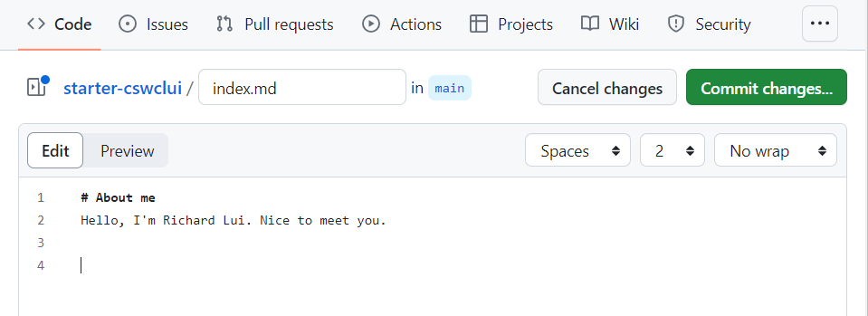
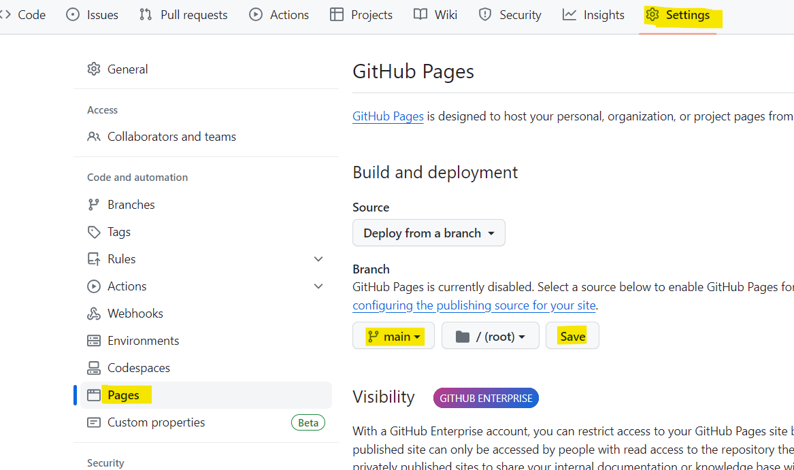
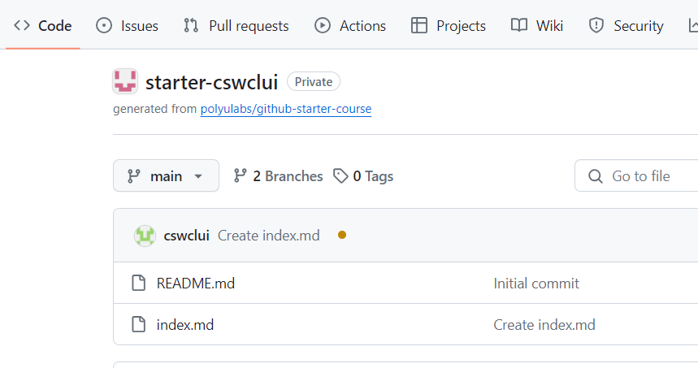
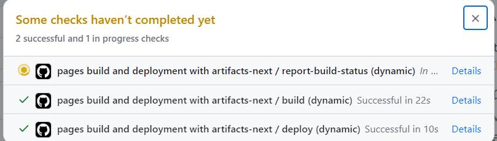
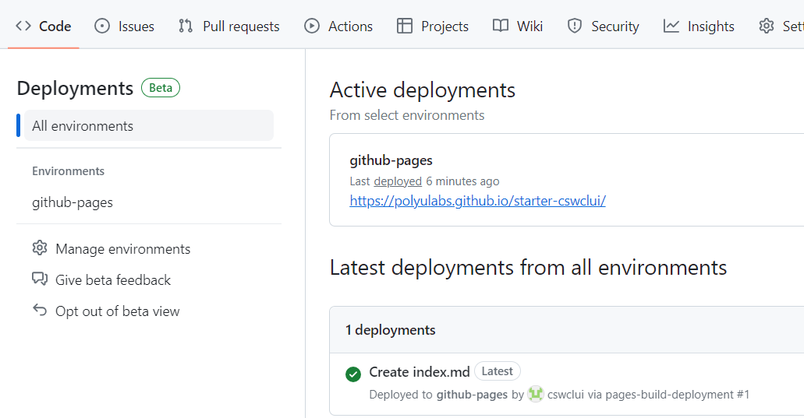

# Exercise: GitHub Page

A Github page is a static website hosted on Github. In this lab, you will create a Github page for yourself. You can use this page to introduce yourself to the world. 

1. Create a new repository in your Github Account .
2. Inside your repository, create a new page "index.md" in the root folder of your `main` branch. Give an introduction about yourself. Commit th changes.
   
3. Setup the Github page under the `Settings` tab. 
   
4. Whenever there are changes in the `main` branch, the Github page will be updated automatically. Github actions will be triggered to build and deploy the page. You can see the status of the Github actions under the `Actions` tab.
    
    
5. After the Github action is completed, you can see the Github page under the `Deployments` tab under the `Actions` tab. 
   - Click on the link to see the Github page. 
   - Your URL should be in the form of `https://<organization-name>.github.io/<your-repository-name>/index.html`
   - *Remark*: Your `index.md` will be converted to `index.html` by Github actions when it is deployed.
   
6. Add the link to your Github Page and include an image of yourself to the page. You may upload an image to your Github Folder or provide the URL to the image.

   Example:
   
```
[Github Page](https://github.com/[your Github ID])
  
```


