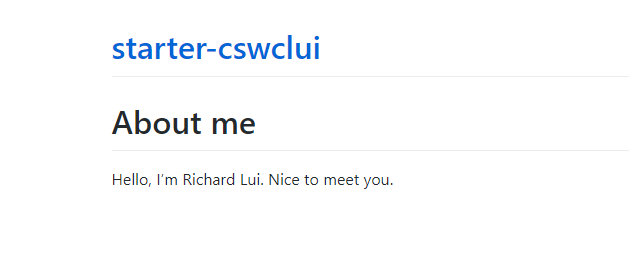

# Exercise: GitHub Page

A Github page is a static website hosted on Github. In this lab, you will create a Github page for yourself. You can use this page to introduce yourself to the world. 

1. Visit the [invite link](https://classroom.github.com/a/bZ5sYH2F). Complete the steps and visit your repository.
2. A GitHub repository will be created for you under our Github Organization.
3. Inside your repository, create a new page "index.md" in the root folder of your `main` branch. Give an introduction about yourself. Commit th changes.
   
   
4. Setup the Github page under the `Settings` tab. 
   
5. Whenever there are changes in the `main` branch, the Github page will be updated automatically. Github actions will be triggered to build and deploy the page. You can see the status of the Github actions under the `Actions` tab.
    
    
6. After the Github action is completed, you can see the Github page under the `Deployments` tab under the `Actions` tab. 
   - Click on the link to see the Github page. 
   - Your URL should be in the form of `https://<organization-name>.github.io/<your-repository-name>/index.html`
   - *Remark*: Your `index.md` will be converted to `index.html` by Github actions when it is deployed.
   
7. The complete page should look like this:
   

