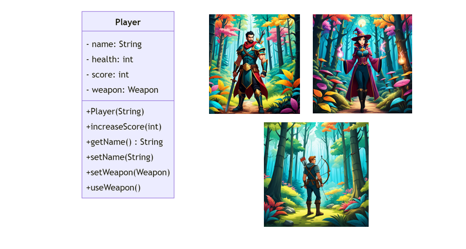
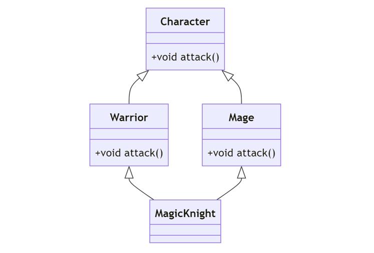
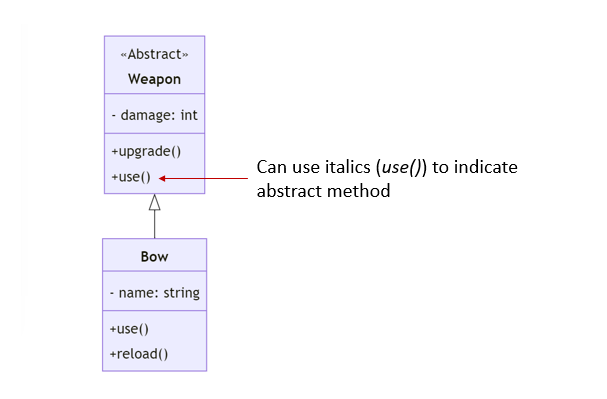
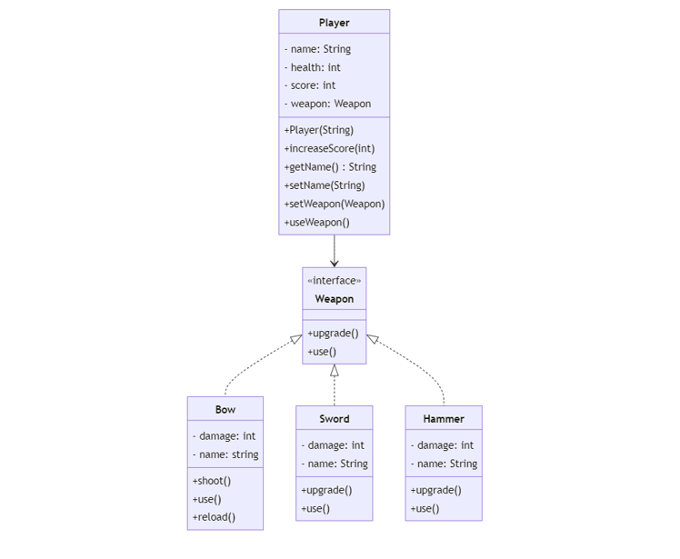
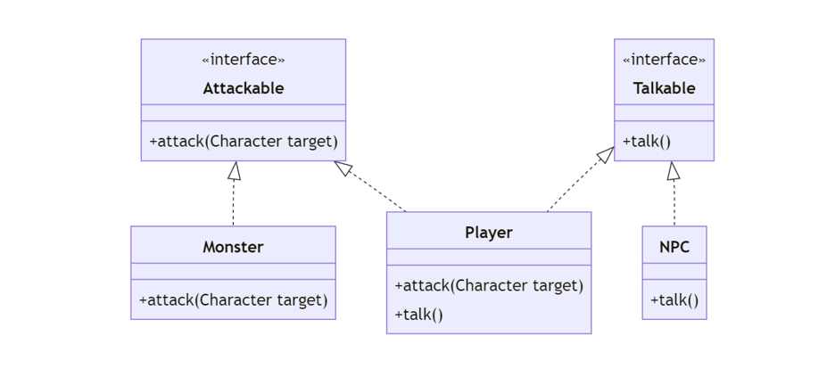

# Table of Contents

- [Table of Contents](#table-of-contents)
- [Introduction to Object-Oriented Design](#introduction-to-object-oriented-design)
- [Fundamental OO Concepts](#fundamental-oo-concepts)
  - [Encapsulation](#encapsulation)
  - [Inheritance](#inheritance)
  - [Multiple Inheritance](#multiple-inheritance)
  - [Interface](#interface)
  - [Abstract class](#abstract-class)
  - [Abstraction](#abstraction)
  - [Composition and Delegation](#composition-and-delegation)
  - [Program to an interface](#program-to-an-interface)
  - [Polymorphism](#polymorphism)
  - [Relationship between Classes](#relationship-between-classes)
- [The SOLID Principle](#the-solid-principle)
  - [Single Responsibility Principle (SRP)](#single-responsibility-principle-srp)
  - [Open/Closed Principle (OCP)](#openclosed-principle-ocp)
  - [Liskov Substitution Principle (LSP)](#liskov-substitution-principle-lsp)
    - [Example](#example)
    - [Using Interface to model behaviors](#using-interface-to-model-behaviors)
  - [Interface Segregation Principle (ISP)](#interface-segregation-principle-isp)
  - [Dependency Inversion Principle (DIP)](#dependency-inversion-principle-dip)
    - [Saving the game](#saving-the-game)
    - [Cohesion vs. Coupling](#cohesion-vs-coupling)
    - [Dependency Inversion Principle (DIP)](#dependency-inversion-principle-dip-1)
    - [Inversion of Control (IoC) container](#inversion-of-control-ioc-container)
    - [Testing with Mock objects](#testing-with-mock-objects)

<div style="page-break-before: always;" />

#  Introduction to Object-Oriented Design
Object-Oriented Design (OOD) is a programming paradigm that uses "objects" to design applications and computer programs. By using OOD, we can make our software more modular, flexible, and extensible. In this lecture, we will learn about different Object-Oriented (OO) concepts using an RPG game as an example.

Classs and  Objects are fundamental concepts in OO design.
- A **Class** is a blueprint for an object.
- An **Object** is an entity that contains both data and behavior.

Our RPG game may support multiple players to play in the game. We can model each player as an object. The `Player` class in the RPG game serves as a blueprint for creating player objects. It encapsulates the attributes and behaviors that are common to all players.
- **Attributes** represent the properties or state of an object (The state of an object means the values of its attributes at a given point in time). For the `Player` class, there are several attributes such as `name`, `health`, and `score` that define the properties or the state of a Player object:
  - `name`: A String representing the player's name.
  - `health`: An integer value representing the player's health.
  - `score`: An integer value representing the player's score.
- **Methods**: Methods define the behavior of an object, detailing what the object can do. 
  - In the `Player` class, methods like `increaseScore` alter the object's attribute value.
  - The `useWeapon` method is an example of a behavior that a Player object can perform (e.g. allow the `Player` object to use a weapon)

<div style="page-break-before: always;" />

In OOD, UML class diagrams can be used to visually represent the structure of the `Player` class:



Each class is represented as a rectangle divided into three sections.
- The top section contains the name of the class (`Player` in this case). 
- The middle section contains the attributes (`name`, `health`, and `score`) with their corresponding types. 
  - The `-` symbol before the attribute names (`name`, `health`, and `score`) indicates that they are private, meaning they can only be accessed within the class itself.
- The bottom section shows the methods in the class
  - The `+` symbol before the method names (`Player(String)`, `increaseScore(int)`, `getName()`, etc) indicates that they are public, meaning they can be accessed from other classes.
    - The `()` after the method names indicates that they are methods (functions) of the class.
  - The `String`, `int`, and other data types represent the types of attributes and return types of methods.
  - The `: String` after `getName()` indicates that the return type of the method is `String`.
  - The parameters of the methods (`String name` in `Player(String)`, `int points` in `increaseScore(int)`, etc) indicate the input values that can be passed to the methods when they are called.


<div style="page-break-before: always;" />

Here is the code for the `Player` class in Java.

```java
public class Player {
    private String name;
    private int health;
    private int score;

    // Constructor 
    public Player(String name) {
        this.name = name;
        this.health = 100; // Default health for a new player
        this.score = 0; // Default score for a new player
    }

    public void increaseScore(int points) {
        score += points;
    }

  // Getter methods
    public String getName() {
        return name;
    }

    // Setter methods
    public void setName(String name) {
        this.name = name;
    }

    public void useWeapon() { //use the weapon
        // Player use the weapon ...
    }
}
```

About the code:
- A `constructor` is a special method that is invoked when an object of a class is instantiated. It is used to initialize the attributes of the class. The `Player` constructor, for example, initializes the player's name, health, and score.
- *Setter Methods*: These methods are used to modify the state of an object. E.g. The `setName(String name)` method in the `Player` class is a setter method that allows you to change the player's name.
- *Getter Method*: The getter method is used to access the value of a private field. In this class, `getName()` is a getter method that returns the value of the name field. 
  
An `object` is an instance of a class. 
- To create a `Player` object, we simply instantiate the class with the new keyword.
- Multiple objects can be created from the same class. Each object has its own state and behavior. 

<div style="page-break-before: always;" />

For example, we can create two `Player` objects, `player1` and `player2`, with different names, health, and scores.

```java
Player player1 = new Player("Alice");
Player player2 = new Player("Bob");

```

Methods allow for the manipulation and interaction with an object's data. In Java, object's methods are invoked using the "dot" notation. For instance, 

```java
String name = player1.getName() //get the player's name
player1.increaseScore(10); //increases player1's score by 10
```

<div style="page-break-before: always;" />


# Fundamental OO Concepts

## Encapsulation

Encapsulation is a fundamental principle of object-oriented programming that restricts direct access to an object's attributes. It avoids the data and code within an object from being randomly accessed by other code defined outside the object or class.


The `Monster` class represents a monster in the game. It includes attributes like `name` and `health`, and methods to manage these attributes.

```java
public class Monster {
    private String name;
    private int health;

    // Constructor
    public Monster(String name, int health) {
        this.name = name;
        this.health = health;
    }

    public void takeDamage(int amount) {
        health -= amount;
        if (health < 0) {
            health = 0;
        }
    }

   //other methods ...
}
```

<div style="page-break-before: always;" />

Let's instantiate three monsters from the `Monster` class.

```java
Monster goblin1 = new Monster("Goblin", 50);
Monster goblin2 = new Monster("Goblin", 50);
Monster orc1 = new Monster("Orc", 100);
```

Here are the three types of visibility modifiers in Java:
1. **Public**: The public modifier allows the attribute or method to be accessed from anywhere, even outside the class.
2. **Private**: The private modifier restricts access to the attribute or method to within the class itself.
3. **Protected**: The protected modifier allows access to the attribute or method within the class itself and any subclasses of the class.
4. **Default**: If no visibility modifier is specified, the attribute or method is accessible within the class itself and any other class in the same package.


In the `Monster` class, the `name` and `health` variables are declared as private, which means they cannot be accessed directly from outside the class. 

For instance, the following statement will generate compilation errors. 

```java
class Main {
    public static void main(String[] args) {
        Monster goblin = new Monster("Goblin", 50);
        goblin.health = -30; // Error: name has private access in Monster
    }
}
```
By making the visibility of the variable `health` private, it cannot be directly accessed or modified from outside the class. This prevents the `health` from being set to an invalid value (e.g. negative number) accidentally. 

Public methods are provided to allow controlled access to the private attributes. 
- For instance, the `getName()` and `getHealth()` methods allow external code to access the `name` and `health` attributes of a `Monster` object. 
- The `takeDamage(int amount)` method is a public method that allows external code to interact with the `health` attribute in a controlled way. It reduces the `health` by the amount specified, but also ensures that `health` cannot go below 0.

<div style="page-break-before: always;" />

In inheritance, we can override the methods of the superclass. For instance, we can override the `takeDamage` method in the `Monster` class in a subclass `Boss` to make the boss more powerful with less damage taken. Example:

```java
public class Boss extends Monster {
    public Boss(String name, int health) {
        super(name, health);
    }

    @Override
    public void takeDamage(int amount) {
        health -= amount / 2; // Boss takes half damage
        if (health < 0) {
            health = 0;
        }
    }
}
```

<div style="page-break-before: always;" />

##  Inheritance

Inheritance is a mechanism in Java that allows one class to acquire the properties (fields) and behaviors (methods) of another class. 
- The class which inherits the properties of another class is known as the **subclass** (or derived class, child class)
- The class whose properties are inherited is known as the **superclass** (or base class, parent class).


Let's create a class  `Warrior` that extends `Player`. 
- The `Warrior` class inherits all the public and protected members (fields and methods) of the `Player` class.


```java
public class Warrior extends Player {
    private int armor;

    public Warrior(String name, int armor) {
        super(name);
        this.armor = armor;
    }
}
```

<div style="page-break-before: always;" />

We may add new methods that are specific to a `Warrior`. For example, a Warrior might have a method to `attackWithSword()`.

```java
public class Warrior extends Player {
    private int armor;

    public Warrior(String name, int armor) {
        super(name);
        this.armor = armor;
    }

    //getter and setter methods ...

    public void attackWithSword() {
        // Implementation of attackWithSword
    }
}
```

Inheritance promotes reusability by allowing you to reuse code that's already been tested and debugged.

For instance, let's consider the `Warrior` class that extends the `Player` class in our game. 
- The `Player` class might have attributes like `name`, `health`, and `weapon`, and methods to manage these attributes and perform actions like `attack()`.
- When we create the `Warrior` class, we don't have to write all this code again. Instead, we can extend the `Player` class, and the `Warrior` class will automatically have all the attributes and methods of the `Player` class. This promotes reusability.

---

**Exercise**: 
Define the `Mage` Class:
1. The `Mage` class should extend the `Player` class.
2. Add a new attribute `mana` (int) to represent the mage's magic energy.
3. Add a constructor that takes `name` and `mana` as parameters and initializes these attributes along with the attributes from the `Player` class.
4. Add getter and setter methods for `mana`.
5. Add a method `castSpell()` that represents the mage casting a spell. The implementation can be simple, such as printing a message.


<!--
**Sample solution**:

```java
public class Mage extends Player {
    private int mana;

    public Mage(String name, int mana) {
        super(name);
        this.mana = mana;
    }

    public int getMana() {
        return mana;
    }

    public void setMana(int mana) {
        this.mana = mana;
    }

    public void castSpell() {
        if (mana > 0) {
            System.out.println(getName() + " casts a spell!");
            mana--;
        } else {
            System.out.println(getName() + " is out of mana!");
        }
    }
}
```
-->

<div style="page-break-before: always;" />

## Multiple Inheritance

Java does not support multiple inheritance. Multiple inheritance is a language feature that allows a class to inherit from multiple parent classes. While it can provide flexibility and code reuse, it also introduces challenges, one of which is the "Diamond Problem" or "Diamond Inheritance Problem."



The Diamond Problem occurs when a class inherits from two or more classes that have a common base class
- In the example above, the `MagicKnight` class inherits from both the `Warrior` and `Mage` classes, which themselves inherit from the `Character` class. This creates a diamond-shaped inheritance hierarchy.
- The issue arises when both the `Warrior` and `Mage` classes define their own implementation of the `attack` method, which overrides the default implementation in the `Character` class. In the `MagicKnight` class, there is ambiguity about which `attack` method should be used. Should it use the `attack` implementation from `Warrior` or `Mage`?

The Diamond Problem leads to code ambiguity and potential conflicts. To avoid such issues, languages such as Java often promote alternative approaches like interfaces or composition, which provide a more flexible and manageable way to achieve code reuse and extensibility without the problems associated with multiple inheritance.

<div style="page-break-before: always;" />

## Interface 

An interface in OO defines a contract that a class agrees to follow. The purpose of an interface is to specify a contract or behavior that classes can implement. 
- An interface can provide *no implementation* at all.
- Interface does not include any attributes
  - Interfaces in Java are used to declare methods that a class must implement, not to define the state of an object.


Let's begin by defining a `Weapon` interface with `use` and `upgrade()` methods.

```java
public interface Weapon {
    void use();
    void upgrade();
}
```
Abstract methods are methods that are declared without a body and are meant to be implemented by classes that implement the interface. For instance, the `use()` and `upgrade()` methods in the `Weapon` interface are abstract methods.

We will implement the `Weapon` interface in two distinct classes: `Bow` and `Sword`. 

<div style="page-break-before: always;" />

The `Bow` class includes methods `upgrade()`, `use()`, and `reload()`.
- `upgrade()`: Increases the bow's damage and provides feedback.
- `use()`: Simulates the action of shooting an arrow.
- `reload()`: Restocks the bow with arrows.

```java
public class Bow implements Weapon {
    private int damage;
    private int arrows; 
    private String name;

    // Constructor and getter/setter methods ...

    public void upgrade() {
        damage += 10; 
        System.out.println(name + " has been upgraded");
    }

    public void use() {
        System.out.println("Shooting an arrow");
    }

    public void reload() {
        arrows = 10; // Reloads the bow with 10 arrows
    }
}
```

The `Sword` class includes methods `upgrade()` and `use()`.
- `upgrade()`: Increases the sword's damage and provides feedback.
- `use()`: Simulates the action of swinging the sword.

```java
public class Sword implements Weapon {
    private int damage;
    private String name;

    // Constructor and getter/setter methods ...

    public void upgrade() {
        damage += 15; 
        System.out.println(name + " has been upgraded.");
    }

    public void use() {
        System.out.println("Swinging the sword");
    }
}
```

In both classes, the `use()` method is an essential part of the `Weapon` interface's contract. This method provides a way to use the weapon, and its implementation varies between the `Bow` and `Sword`.


Here's how we can instantiate the `Sword` and `Bow` objects:

```java
// Creating and using a Sword object
Sword sword = new Sword();
sword.setName("Sword of Power");
sword.setDamage(50);
sword.use(); 


// Creating and using a Bow object
Bow bow = new Bow();
bow.use();
bow.reload(); // Reload the bow after use
bow.upgrade();
```

Suppose that players can use their weapons during gameplay. 
- The `use` method in the `Weapon` class represents the action of using the weapon, such as swinging a sword or shooting an arrow with a bow. 
- To incorporate this action into the `Player` class, we can add a method that allows the player to use their weapon. 

In the following updated code:
- The `Player` class now has a method `useWeapon()`. This method calls the `use()` method on the `weapon` object, which is an instance of a class that implements the `Weapon` interface.
- When a player decides to use their weapon, the `useWeapon()` method will invoke the specific `use()` method of the weapon they are holding, whether it's a sword, bow, or any other weapon type.


```java
public class Player {
    private Weapon weapon;
    private String name;
    private int health;
    private int score;

    public void useWeapon() {
        weapon.use();
    }

   public void setWeapon(Weapon weapon) {
        this.weapon = weapon;
    }

    // other parts of the code
}
```

<div style="page-break-before: always;" />


## Abstract class

Abstract class vs. Interface
- An interface is used to group related methods with empty bodies. It specifies "what" a class must do, but not "how." 
- An abstract class, in contrast, can have a mix of methods with and without implementations. It can provide a common base of functionality for subclasses. It may also define attributes that a common to subclasses.
- Both interfaces and abstract classes abstract the concept and provide polymorphism. 

For instance, we can instead define the abstract class `Weapon` to define a concrete method `getDamage()`, while still requiring subclasses to implement the abstract `use()` method.

  ```java
  public abstract class Weapon {
    int damage;
    abstract void use();

    public void upgrade() { // Concrete method
        damage += 10;
    }

    public void use(); // Abstract method
  }
  ```

Any subclass of `Weapon` needs to extend the abstract class rather than implement it like an interface. For instance, a `Bow` class extending the `Weapon` abstract class would inherit the `getDamage()` method and must provide its own implementation of the `use()` method:

```java
public class Bow extends Weapon {
    public void use(){ // Implementation of the use() method
        System.out.println("Shooting an arrow");
    }

    public void reload(){
        System.out.println("Reloading the bow");
    }
}
```
<div style="page-break-before: always;" />

Here is the UML diagram.



<div style="page-break-before: always;" />


## Abstraction

**Abstraction** in object-oriented design is a process of hiding the implementation details and showing only the essential functionality to the user. It lets you focus on what the object does instead of how it does it.





```java
public class Player {
    private Weapon weapon;

    public void useWeapon() {
        weapon.use();
    }

    // other parts of the code ...
}
```

In our game,
- The `Player` class interacts with the `Weapon` interface, not the specific classes that implement this interface. 
- The `Weapon` interface provides a high-level understanding of what a weapon should be able to do (i.e., it should be usable), without getting into the specifics of how this is done. 
- When a player decides to use their weapon, the weapon's `use` method is called. The `Player` class doesn't need to know how the `use` method works for each specific type of weapon. It only needs to know that the `use` method exists and can be called on the weapon. The specific implementation details of how each type of weapon is used are hidden from the `Player` class. 

<div style="page-break-before: always;" />


## Composition and Delegation

**Composition** involves composing a class using instances of other classes or interfaces to achieve the desired functionality. 

**Delegation** is a core concept in composition, where an object handles a request by delegating it to a second helper object (the delegate). This allows distributing responsibilities among different classes and promotes code reuse and flexibility.


For instance, for the `Player` class,
- It stores a reference to a `Weapon` object and has a method `useWeapon()` that calls the `use()` method on the `Weapon` object. 
- Instead of the `Player` class implementing the `use()` method itself, it delegates this responsibility to the `weapon` object. 
- This allows the `Player` class to use the behavior defined in the `Weapon` class without needing to know the details of how this behavior is implemented.

<div style="page-break-before: always;" />

## Program to an interface

"Program to an interface" is an OO Design principle which suggests that software components should interact with each other through interfaces rather than concrete implementations. This principle promotes decoupling and enhances the flexibility and maintainability of the code.

In our RPG game, a player can use different types of weapons. Assume that the `Player` class contains a function with the following code:

```java
public class Player {
    public void useWeapon(Bow b) {
        b.use();
    }
}
```

If we want to change the player's weapon to a `Sword`, we need to modify the function in the `Player` class as follows.

```java
public class Player {
    public void useWeapon(Sword s) {
        s.use();
    }
}
```

In this example, the `Player` class is **tightly coupled** with the `Bow` class. We have to change the `Player` class if we want to use a different types of weapons. It makes the code less flexible and maintainable.

Suppose our `Player` class is programmed to an interface (`Weapon`) instead of a concrete implementation (e.g. `Bow`, `Sword`), 

```java
public class Player {
    public void useWeapon(Weapon w) {
        s.use();
    }
}
```

If you want to introduce a new type of weapon, you just need to create a new class that implements `Weapon`, and the `Player` class can use it without any changes.

<div style="page-break-before: always;" />

## Polymorphism

Polymorphism, a core principle in object-oriented programming (OOP), is derived from the Greek words meaning "many shapes."
- It refers to the ability of a variable, function, or object to assume various forms. 
- In OO, Polymporphism is often achieved through inheritance and interface implementation.
- Allows for writing versatile code that does not have to be aware of the specific subtype of an object, as long as the object adheres to a defined interface.

In the following example, with both `Bow` and `Sword` classes implementing the `Weapon` interface, they demonstrate polymorphism by being used interchangeably wherever a `Weapon` type is expected. Both classes possess a `use()` method, albeit with differing implementations:

```java
Weapon w;
w = new Bow();
w.use(); // Prints "Shooting an arrow"

w = new Sword();
w.use(); // Prints "Swinging the sword"
```


The benefit of this approach is the creation of flexible and extendable code. It allows for the introduction of varied behaviors (like different ways of using weapons) depending on the type of object at runtime, without the need for changing existing code. 

<div style="page-break-before: always;" />

For example, introducing a new weapon type like a `Hammer` is straightforward. The `Hammer` class, implementing the `Weapon` interface, can define its unique version of the `use()` method:

```java
public class Hammer implements Weapon {
    private int damage;
    private String name;

    // Constructor and other methods ...

    public void use() {
        System.out.println(name + " smashes causing " + damage + " damage.");
    }
}
```

Now, the `Hammer` can be seamlessly integrated into the game and used by the `Player` class. A `Hammer` object can be created and set as the player's weapon. There is no need to modify the `Player` class or any other existing code.

```java
// Create a new Hammer object
Hammer hammer = new Hammer();
...
player.setWeapon(hammer);
player.useWeapon(); // Use the hammer

```

In our context, polymorphism allows the `Player` class to use any object that implements the `Weapon` interface. For instance, the `Player` class can use a `Bow` object, a `Sword` object, or a `Hammer` object. This leads to a more flexible and maintainable codebase as new functionalities can be added with minimal changes.


<div style="page-break-before: always;" />

## Relationship between Classes

In UML (Unified Modeling Language) class diagrams, the structure and relationships in an object-oriented system can be graphically represented.
- **Classes**: Represented by rectangles divided into three parts: the top part for the class name, the middle part for attributes, and the bottom part for methods.
- **Relationships**: Different types of lines and arrows are used to depict various relationships like inheritance, association,  interface implementation (realization), and association.


Types of relationships in OO:
1.	**Is-a Relationship** (Inheritance/Generalization):
- This is depicted by a line with a closed, unfilled arrowhead pointing from the subclass to the superclass.
- In our game, `Warrior` and `Mage` are subclasses of `Player`. This is an is-a relationship because a `Warrior` is-a `Player`, and a `Mage` is-a `Player`.


2.	**Has-a Relationship** (Association/Aggregation/Composition):
- This represents that an object of one class 'owns' or 'uses' objects of another class.
- In our game, the `Player` class has a `Weapon`. This is a has-a relationship because a `Player` has-a `Weapon`.

3.	**Behaves-like-a** (Interface Implementation):
- This is depicted by a dashed line with a closed, unfilled arrowhead pointing from the implementing class to the interface. In our game, `Bow` and `Sword` implement the `Weapon` interface.

<div style="page-break-before: always;" />


# The SOLID Principle

SOLID is an acronym representing five key design principles intended to make software designs more understandable, flexible, and maintainable.

1. **Single Responsibility Principle (SRP):** A class should have only one reason to change.
2. **Open/Closed Principle (OCP):** Software entities (classes, modules, functions, etc.) should be open for extension but closed for modification.
3. **Liskov Substitution Principle (LSP):** Objects of a superclass should be replaceable with objects of its subclasses without affecting the correctness of the program.
4. **Interface Segregation Principle (ISP):** Clients should not be forced to depend on interfaces they do not use. It is better to have multiple specific interfaces rather than a single general-purpose interface.
5. **Dependency Inversion Principle (DIP):** High-level modules should not depend on low-level modules. Both should depend on abstractions. Abstractions should not depend on details, but details should depend on abstractions.

These principles serve as guidelines for designing software systems that are modular, maintainable, and easily extensible.

## Single Responsibility Principle (SRP)

The Single Responsibility Principle requires that a class should have only one reason to change, meaning it should have only one job or responsibility.

In our RPG game, we ensure each class has a single responsibility. 
- The `Weapon` class is only responsible for weapon-related attributes and behaviors. It should not include logic for saving game state or managing player health.
- The `Player` class is responsible for player-related behaviors. It's not concerned with how a weapon is used; it only knows that it can use a weapon.

By delegating the responsibility of using a weapon to the Weapon class, the `Player` class adheres to the SRP. If the way a weapon is used needs to change, you would modify the `Weapon` class, not the `Player` class. This separation of concerns leads to more maintainable and flexible code.

<div style="page-break-before: always;" />

## Open/Closed Principle (OCP)

The Open/Closed Principle states that software entities should be **open for extension but closed for modification**. This allows for extending the functionality of a class without modifying its existing code.

Let's revisit the `Weapon` interface and `Player` class.

```java
public interface Weapon {
    void use();
    void upgrade();
}
```

```java
public class Player {
    Weapon weapon;
    // Rest of the code...

    public void setWeapon(Weapon weapon) {
        this.weapon = weapon;
    }

    public void useWeapon() {
        weapon.use();
    }
}
```

In our game, when introducing new weapon types like `MagicWand`, instead of modifying the existing `Weapon` class, we may extend it to support new types of weapons. 


```java
public class MagicWand implement Weapon {
    private int magicPower;

    // Magic wand specific methods...
    void use (){
        System.out.println("Casting a spell");
    }

    void upgrade() {
        magicPower += 10;
    }
}
```

<div style="page-break-before: always;" />

We can then use the `MagicWand` class as follows:

```java
Weapon my_weapon = new MagicWand();
player.setWeapon(my_weapon);
player.useWeapon();
```

Open-closed principle is a powerful concept in object-oriented design where you can extend the functionality of a class without modifying its existing code. It allows for adding new features without breaking existing code. This leads to more maintainable and flexible code.


<div style="page-break-before: always;" />

## Liskov Substitution Principle (LSP)
LSP states that: 
- Objects of a superclass should be replaceable with objects of its subclasses without altering the correctness of the program. 
- In simpler terms, if you have a parent class and a child class, then anywhere in your code where you use an instance of the parent class, you should be able to use an instance of the child class without causing any issues or changes in behavior.
- This principle is used to ensure that a subclass can stand in for its superclass without causing any issues in the program.

### Example 
Suppose that in our RPG game, there are three types of characters: `Player`, `Monster`, and `NPC` (Non-Player Character). Let's define the `Character` class as the base class for all three types of characters. 

**Base Class: `Character`**:  This represents a general character in the RPG game. To allow the subclasses to reuse the functionality of the base class, the `Character` class defines two methods: `attack` and `talk`. 


```java
public class Character {
    private String name;
    //other attributes

    public void attack(Character target) {
        System.out.println(name + " attacks.");
    }

    public void talk() {
        System.out.println(name + " talks.");
    }
}
```

`Player` is a subclass of `Character` that inherits the `attack` and `talk` methods. This class signifies that players in the game can both attack and talk.

```java
public class Player extends Character {
    @Override
    public void attack(Character target) {
        super.attack(target);
    }

    @Override
    public void talk() {
        System.out.println("The player is talking")
    }
}
```

<div style="page-break-before: always;" />

`Monster` is another subclass of `Character`. While it retains the attacking capability (inherited from `Character`), it overrides the `talk` method to throw an exception, indicating that monsters in the game cannot talk.

```java
public class Monster extends Character {
    @Override
    public void attack(Character target) {
        super.attack(target);
    }

    @Override
    public void talk() {
        throw new UnsupportedOperationException("Monsters cannot talk.");
    }
}
```

`NPC` (Non-Player Character), which extends the `Character` class, can talk but not attack others. The `attack` method is overridden to throw an exception, reflecting that NPCs are not designed for combat in the game. 

```java
public class NPC extends Character {
    @Override
    public void talk() {
        System.out.println("NPC is talking")
    }

    @Override
    public void attack(Character target) {
        throw new UnsupportedOperationException("NPCs cannot attack.");
    }
}
```

> Remark: In Java, exceptions are used to signal that something unusual has occurred and it passes the responsibility of handling the exception to the caller.

<div style="page-break-before: always;" />


Let's consider the following example. `npc.attack(player) ` and `monster.attack(player)` will throw an exception. 
  
```java
Character player = new Player();
Character monster = new Monster();
Character npc = new NPC();
player.attack(monster);
player.talk();
monster.attack(player);
monster.talk();
npc.talk();
npc.attack(player);
```
LSP states that objects of a superclass should be replaceable with objects of its subclasses without altering the correctness of the program. 
- However, in this example, the `NPC` and `Monster` classes cannot be used as a replacement for the `Character` class. This may lead to runtime errors, as these subclasses do not fully support all behaviors of the base class. 
- The subclass behaves differently from the base class, which violates the LSP. This can cause bugs that are hard to detect because the code seems correct when looking at the superclass but fails when using some of the subclasses


<div style="page-break-before: always;" />
    
### Using Interface to model behaviors

While inheritance is a commonly used mechanism in object-oriented programming for sharing behavior among classes,  inheritance may also create a tight coupling between the base class and its subclasses. 
- Since the subclasses inherit the methods/attributes from the base class,  changes to the base class may have unintended ripple effects on all its derived classes. For instance, suppose the base case `Player` has an attribute `position` to store the player's position in the game. If we decide to remove the `position` attribute from the `Player` class, we also need to modify the `Monster` and `NPC` classes.
- This can make maintenance and future updates more challenging.

Instead of using inheritance, we can define interface classes to address the limitations of inheritance. In our RPG example, we can define interfaces like `Attackable` and `Talkable` which models the behavior of different types of characters in the game.



We first define the interface to model the behavior of different types of characters.
- `Attackable` is an interface with the method `attack(Character target)`, which defines the behavior to attack other characters.
- `Talkable` is another interface with the method `talk()` that represents the ability to talk.
  
```java
public interface Attackable {
    void attack(Character target);
}

public interface Talkable {
    void talk();
}
```

<div style="page-break-before: always;" />


The `Player` class implements both `Attackable` and `Talkable` interfaces.
- By implementing `Attackable`, the `Player` class provides concrete implementations of the `attack`  methods
- By implementing `Talkable`, the `Player` class also provides a concrete implementation of the talk method, giving it the ability to speak.

```java
public class Player implements Attackable, Talkable {
    @Override
    public void attack(Character target) {
        System.out.println("Player attacks.");
    }

    @Override
    public void talk() {
        System.out.println("Player is talking.");
    }
}
```

The `Monster` class implements the `Attackable` interface.
- It provides concrete implementations of the `attack` , meaning it can attack other entities and take damage.

```java
public class Monster implements Attackable {
    @Override
    public void attack(Character target) {
        System.out.println("Monster attacks.");
    }
}
```

The `NPC` class implements the `Talkable` interface. It provides an implementation of the talk method, which means an NPC can engage in conversation.

```java
public class NPC implements Talkable {
    @Override
    public void talk() {
        System.out.println("NPC is talking.");
    }
}
```

<div style="page-break-before: always;" />

Here is an example of using the interface.
```java
public class Game {
    public static void main(String[] args) {
        Talkable player = new Player();
        Talkble npc = new NPC();
        npc.talk();
        player.talk();
    }
}
```


Using interfaces instead of inheritance provides enhanced flexibility, modularity, and maintainability.
- Classes like `Player`, `Monster`, and `NPC` can implement multiple interfaces, allowing for a mix-and-match approach to functionality. 
- This design enables classes to implement only the behaviors they need, avoiding the constraints and potential complexity of a rigid inheritance hierarchy. 
- The interface contains only the definitions of the methods, not the implementation. The subclasses are coupled only to the interface, not to the implementation. In other words, the issue that the changes in the implementation of superclasses may affect the subclasses is avoided. Remark: The dependency on an interface is considered a loosely coupled relationship.


## Interface Segregation Principle (ISP)

The Interface Segregation Principle states that no client should be forced to depend on methods it does not use. 
-  Instead of having a single large interface for all actions a character can perform, break it down into smaller interfaces. For example, `Attackable` for attack actions, `Talkable` for talking actions, etc.
- **Implement Only What Is Needed**: Each type of character (like Monster, Player, NPC) should only implement the interfaces that are relevant to it. For instance, a Monster might only implement `Attackable` and not `Talkable`.

This approach makes your code more flexible and maintainable. If you need to add a new type of action, you can create a new interface without modifying existing interfaces or classes that don’t need that action.

<div style="page-break-before: always;" />

## Dependency Inversion Principle (DIP)

### Saving the game

We will start with a `GameSaver` class for saving the state of a game. Consider the following implementation of the class.

```java
public class GameSaver {
    private MySQLDatabase database; //GameSaver is coupled to MySQLDatabase

    public GameSaver() {
        this.database = new MySQLDatabase();
    }

    public void saveGame(GameState gameState) {
        database.saveGame(gameState);
    }
}
```

To save the game, we may execute:
```java
GameSaver gameSaver = new GameSaver();
gameSaver.saveGame(gameState);
```

### Cohesion vs. Coupling

**Cohesion** is used to indicate the degree to which a class has a single, well-focused purpose. 

**Coupling** is the degree to which one class knows about another class.  
- If a class has a high degree of knowledge about another class, we say that these classes are "tightly coupled". 
- It makes the system harder to maintain and modify.

Good OO design should be loosely coupled and highly cohesive.
- Easier to develop
- Easier to maintain
- Easier to add new features
- Less fragile.

In the previous `GameSaver` example, the `MySQLDatabase` instance represents a dependency of the `GameSaver` class.
- The `GameSaver` class directly instantiates a `MySQLDatabase`` object in its constructor and uses this object to save the game state. 
- `GameSaver` class is tightly coupled with the `MySQLDatabase` class.

The problem with this design is that if you want to change the type of database (for example, from MySQL to MongoDB), you would need to modify the `GameSaver` class. For instance, 

```java
public class GameSaver {
    private MongoDB database; //GameSaver is coupled to MongoDB

    public GameSaver() {
        this.database = new MongoDB();
    }

    public void saveGame() {
        database.saveGame(GameState gameState);
    }
}
```

You have to modify the `GameSaver` class every time you want to change the type of database used by the class. A better approach would be to decouple `GameSaver` from the specific database classes using the "Dependency Inversion Principle".

A "dependency" here  refers to an object that can be used as a service. In this example, the GameServer depends on the concrete implementation of the databases (e.g. MySQLDatabase or MongoDB).


<div style="page-break-before: always;" />

###  Dependency Inversion Principle (DIP)

The DIP states that high-level modules should not depend on low-level modules. Both should depend on abstractions.


In the context of the `GameSaver` example, GameSaver is a high-level module and Database (`MySQLDatabase` and `MongoDB` classes) are  a low-level module. 
- By having `GameSaver` depend on the Database interface (an abstraction), rather than on concrete Database implementations (MySQLDatabase or MongoDB), we are adhering to the Dependency Inversion Principle. 
- This makes `GameSaver` more flexible and easier to maintain, as it can work with any type of database that implements the Database interface.


<div style="page-break-before: always;" />

**Dependency Injection** is a technique that implements the *Dependency Inversion Principle*, where an object receives other objects it depends on, rather than creating them itself. These dependencies are usually provided through a constructor, a setter, or some kind of factory method.

First, we define a `Database` interface, which declares a method `saveGame(GameState gameState)`, which is expected to be implemented by any class that implements this interface. The `saveGame`` method is intended to save a game state to a database.

```java
public interface Database {
    void saveGame(GameState gameState);
}
```
Next, two classes `MySQLDatabase` and `MongoDB` are defined, both of which implement the `Database` interface. This means they provide their own implementations of the `saveGame` method.

```java
public class MySQLDatabase implements Database {
    public void saveGame(GameState gameState) {
        // Implementation for saving game to a MySQL database
    }
}
```
```java
public class MongoDB implements Database {
    public void saveGame(GameState gameState) {
        // Implementation for saving game to a MnogoDB database
    }
}
```

Let's improve the design of the `GameSever` class. 
- The specific type of `Database` (e.g., `MySQLDatabase` or `MongoDB`) is provided to the `GameSaver` class through its constructor. 
- The `GameSaver` class doesn't need to know the specific type of `Database` it's working with. Instead, it works with any object that implements the `Database` interface.

```java
public class GameSaver {
    private Database database; //GamseSaver is coupled to 

    public GameSaver(Database database) {
        this.database = database;
    }

    public void saveGame() {
        database.saveGame();
    }
}
```

By passing different implementations of the *Database* interface to the `GameSaver` constructor, you can save the game using different types of databases without modifying the `GameSaver` class.

For instance, to use the MySQL database, we can first create a `MySQLDatabase` object and pass it to the `GameSaver` constructor.

```java
Database mySqlDatabase = new MySQLDatabase();
GameSaver gameSaver = new GameSaver(mySqlDatabase);
gameSaver.saveGame(); // Save the game state using MySQLDatabase
```

To use the MongoDB database, we can create a `MongoDB` object and pass it to the `GameSaver` constructor. Tere is no need to modify the existing classes (e.g. `GameSaver`)

```java
Database mongoDB = new MongoDB();
GameSaver gameSaver = new GameSaver(mongoDB);
gameSaver.saveGame(); // Save the game state using MongoDB
```

The improved design allows for flexibility in choosing the type of database to use for saving the game. Any class that implements the `Database` interface can be used, making it easy to switch between different types of databases.

**Types of Dependency Injection:**

**Constructor Injection**: The dependencies are provided through a class constructor. 
- This is the most common type of DI and is typically used when the dependency is required for the class to function.

```java
public class GameSaver {
    private Database database;

    //The databse object is injected through this constructor
    public GameSaver(Database database) {
        this.database = database;
    }

    public void saveGame(GameState gameState) {
        database.saveGame(gameState);
    }
}
```
<div style="page-break-before: always;" />

A concrete `Database` object is injected from outside when the `GameSaver` object is instantiated.

```java
Database mySqlDatabase = new MySQLDatabase();
GameSaver gameSaver = new GameSaver(mySqlDatabase);
```

**Setter Injection**: The client exposes a setter method that the injector uses to inject the dependency. 
- This is typically used when the dependency is optional.

 ```java
 public class GameSaver {
    private Database database;

    public void setDatabase(Database database) {
        this.database = database;
    }

    public void saveGame(GameState gameState) {
        if(database != null) {
            database.saveGame(gameState);
        }
    }
}
```

The `GameServer` class should first be created. The setter method is then called to inject the concrete `Database` object.

```java
Database mySqlDatabase = new MySQLDatabase();
GameSaver gameSaver = new GameSaver();
gameSaver.setDatabase(mySqlDatabase);
```

<div style="page-break-before: always;" />

### Inversion of Control (IoC) container

In frameworks like Java Spring, the creation and management of dependencies are delegated to an Inversion of Control (IoC) container. In Java Spring, the IoC container is represented by the `ApplicationContext` class.
  - Responsible for instantiating, configuring, and assembling the objects in your application. 
  - Simplifies the management of dependencies and promotes a coding style that leads to more modular, understandable, and testable code. 

In Spring Boot, you can define your configuration in `application.yaml` (or `application.yml`) files. For example, if you have different configurations for MySQL and MongoDB, you might define two files: `application-mysql.yml` and `application-mongodb.yml`, which contain the configuration for MySQL and MongoDB, respectively.

Here's an example of what `applcation-mysql.yml` might look like:

```yaml
spring:
  datasource:
    url: jdbc:mysql://localhost:3306/mydatabase
    username: myusername
    password: mypassword
```

Here is an example of `application-mongodb.yml`:
```yaml
spring:
  data:
    mongodb:
      uri: mongodb://localhost:27017/mydatabase
```

You can choose which profile (and thus which configuration file) to use when launching the application by setting the `spring.profiles.active` property. For intsance, 

1. To launch your app with MySQL, you may execute

```bash
./mvnw spring-boot:run -Dspring-boot.run.profiles=mysql
```

2. To launch your app with MongoDB, you may execute

```bash
./mvnw spring-boot:run -Dspring-boot.run.profiles=mongodb
```

The Inversion of Control (IoC) container in Spring Boot will instantiate the corresponding object and inject it into the application. This automatic creation, configuration, and injection of dependencies is handled by the Spring Framework's IoC container. By outsourcing the creation and management of dependencies to the IoC container, it allows developers to focus on the core functionality of their application rather than the details of object creation and management. Your application components can remain focused on their core responsibilities, leading to cleaner and more maintainable code.


### Testing with Mock objects
In Unit Testing, functions are tested in isolation. However, some functions may depend on external resources like databases, files, or external systems. For instance, the `GameSaver` class depends on the `Database` interface. However, direct testing of functions that integrate with databases can be slow and unreliable. Also, it may be difficult to simulate various database states (e.g. database connection failure, no more space to save data) during testing. 

The Dependency Inversion Principle (DIP) enhances the testability of the `GameSaver` class by facilitating the injection of mock database objects during tests. 
- A mock object is a simulated object that mimics the behavior of a real object in a controlled manner.
- For instance, a mock object may replicate the functionality of a `Database` object to allow the testing of the `GameSaver` class without involving the setting up and tearing down of a real database.

Let's consider the following `MockDatabase` class which simulates the error condition of failing to connect to the database.
- The `MockDatabase` serves as a simulated `Database` object for testing. 
- Throws a `DatabaseConnectionException` when `simulateFailure` is true, emulating a failed database connection.

```java
public class MockDatabase implements Database {
    public void saveGame(GameState gameState) {
        throw new DatabaseConnectionException("Failed to connect to database.");
    }
}
```
<div style="page-break-before: always;" />

Here is a sample test case when there is a database connection failure to test the error-handling abilities of the `GameSaver` class in JUnit.
   
```java
@Test
public void testSaveGameFailure() {
    MockDatabase mockDatabase = new MockDatabase();
    GameSaver gameSaver = new GameSaver(mockDatabase);
    GameState mockGameState = new MockGameState();
    
    gameSaver.saveGame(mockGameState);

    // check if the gameSaver handles the error gracefully ..
    assertTrue(gameSaver.isErrorLogged());
}
```

By using mock databases, we can isolate the testing of our application logic without involving real database operations. The advantages include:
- Increased speed of the unit test by avoiding the latency of actual database transactions.
- Simplified testing by allowing the easy simulation of various database states.
- Reliable and consistent outcomes, not influenced by external elements such as network interruptions or database downtimes.

