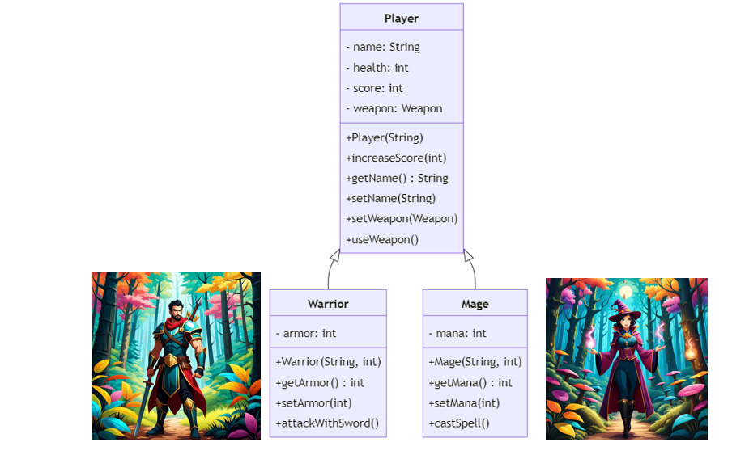

- [Introduction to Object-Oriented Design](#introduction-to-object-oriented-design)
  - [Define the Player Class](#define-the-player-class)
  - [UML Diagram](#uml-diagram)
- [Fundamental OO Concepts](#fundamental-oo-concepts)
  - [Encapsulation](#encapsulation)
  - [Inheritance](#inheritance)
  - [Interface](#interface)
  - [Abstraction](#abstraction)
  - [Composition and Delegation](#composition-and-delegation)
  - [Program to an interface](#program-to-an-interface)
  - [Polymorphism](#polymorphism)
  - [UML Class Diagrams](#uml-class-diagrams)
  - [Interface for defining common behavior](#interface-for-defining-common-behavior)
  - [Abstract class](#abstract-class)
- [The SOLID Principle](#the-solid-principle)
  - [Single Responsibility Principle (SRP)](#single-responsibility-principle-srp)
  - [Open/Closed Principle (OCP)](#openclosed-principle-ocp)
  - [Liskov Substitution Principle (LSP)](#liskov-substitution-principle-lsp)
  - [Interface Segregation Principle (ISP)](#interface-segregation-principle-isp)
  - [Dependency Inversion Principle (DIP)](#dependency-inversion-principle-dip)
    - [Saving the game](#saving-the-game)
    - [Cohesion vs. Coupling](#cohesion-vs-coupling)
    - [Dependency Inversion Principle (DIP)](#dependency-inversion-principle-dip-1)
- [Additional topics related to OO](#additional-topics-related-to-oo)
  - [Multiple Inheritance](#multiple-inheritance)
  - [Inheritance and Its Problems](#inheritance-and-its-problems)
  - [Using Interface to model behaviors](#using-interface-to-model-behaviors)
  - [Testing with Mock objects](#testing-with-mock-objects)
    - [Inversion of Control (IoC) container](#inversion-of-control-ioc-container)


#  Introduction to Object-Oriented Design
Object-Oriented Design (OOD) is a programming paradigm that uses "objects" to design applications and computer programs. This results in more efficient, maintainable, and scalable software.

In this lecture, we will learn about different Object-Oriented (OO) concepts using an RPG game as an example.

## Define the Player Class

In Object-Oriented (OO) design, a Class and an Object are fundamental concepts:
- A **Class** is a blueprint for an object.
- An **Object** is an entity that contains both data and behavior.


Let's consider the `Player` class in the RPG game.

**Attributes**: Attributes represent the properties/state of an object. In the case of the `Player` class, there are several attributes such as `name`, `health`, and `score` that define the state of a Player object.
- `name`: A String representing the player's name.
- `health`: An integer value representing the player's health.
- `score`: An integer value representing the player's score.

```java
public class Player {
    private String name;
    private int health;
    private int score;
}
```

**Methods**: Methods define the behavior of an object, detailing what the object can do. In the `Player` class, methods like `increaseScore` alter the object's state or interact with other objects.

```java
public class Player {
    private String name;
    private int health;
    private int score;

    // Constructor 
    public Player(String name) {
        this.name = name;
        this.health = 100; // Default health for a new player
        this.score = 0; // Default score for a new player
    }

    public void increaseScore(int points) {
        score += points;
    }

    // Getter/Setter and other methods ...
    
}
```

A `constructor` is a special method that is invoked when an object of a class is instantiated. It is typically used to initialize the attributes of the class. The `Player` constructor, for example, initializes the player's name, health, and score.


An `object` is an instance of a class, containing the attributes and methods defined in the class. To create a `Player` object, we simply instantiate the class with the new keyword:

```java
Player player1 = new Player("Alice");
Player player2 = new Player("Bob");
```

Methods allow for the manipulation and interaction with an object's data. The `Player` class includes methods like `increaseScore` and getters/setters for managing the attributes.

In Java, object methods are invoked using the "dot" notation. For example, to increase a player's score and then get the updated score, we might :

```java
public class Game {
    public static void main(String[] args) {
        Player player = new Player("Charlie");
        player.increaseScore(10);
        System.out.println("Player Score: " + player.getScore());
    }
}
```


## UML Diagram


The UML diagram visually represents the structure of the `Player` class, including its attributes, constructor, methods, and their signatures. The class is represented as a rectangle divided into three sections. 
- The top section contains the name of the class (`Player` in this case). 
- The middle section contains the attributes (`name`, `health`, and `score`) with their corresponding types. 
  - The `-` symbol before the attribute names (`name`, `health`, and `score`) indicates that they are private, meaning they can only be accessed within the class itself.
  - The `+` symbol before the method names (`Player(String)`, `increaseScore(int)`, `getName()`, etc) indicates that they are public, meaning they can be accessed from other classes.
- The bottom section shows the methods in the class
    - The `()` after the method names indicates that they are methods (functions) of the class.
  - The `String`, `int`, and other data types represent the types of attributes and return types of methods.
  - The `: String` after `getName()` indicates that the return type of the method is `String`.
  - The parameters of the methods (`String name` in `Player(String)`, `int points` in `increaseScore(int)`, etc) indicate the input values that can be passed to the methods when they are called.

---

# Fundamental OO Concepts

## Encapsulation

Encapsulation is a fundamental principle of object-oriented programming that restricts direct access to an object's attributes. It avoids  the data and code being tied together within an object from being randomly accessed by other code defined outside the object or class.


The `Monster` class represents a monster in the game. It typically includes attributes like name and health, and methods to manage these attributes.

```java
public class Monster {
    private String name;
    private int health;

    // Constructor
    public Monster(String name, int health) {
        this.name = name;
        this.health = health;
    }

    public void takeDamage(int amount) {
        health -= amount;
        if (health < 0) {
            health = 0;
        }
    }

    // Getters
    public String getName() {
        return name;
    }

    public int getHealth() {
        return health;
    }
}
```
In the `Monster` class, the `name` and `health` variables are encapsulated. 
- They are declared as private, which means they cannot be accessed directly from outside the class. 
- Access is provided through the public methods `getName()`, `getHealth()`, and `takeDamage(int amount)`.
- The `takeDamage(int amount)` method is a public method that allows external code to interact with the `health` attribute in a controlled way. It reduces the `health` by the amount specified, but also ensures that `health` cannot go below 0. If another class tries to directly change the health attribute like monster.health = -10;, it would result in a compile error, because health is private. 
- By making `health` private, it cannot be directly accessed or modified from outside the class. This prevents the health from being set to an invalid value (like a negative number) accidentally. 
- The `takeDamage(int amount)` method provides a controlled way to modify the health value, ensuring that it cannot go below 0.

Let's instantiate two monsters. 

```java
Monster goblin = new Monster("Goblin", 50);
Monster orc = new Monster("Orc", 100);
```


##  Inheritance

Inheritance is a mechanism in Java that allows one class to acquire the properties (fields) and behaviors (methods) of another class. 
- The class which inherits the properties of another class is known as the **subclass** (or derived class, child class)
- The class whose properties are inherited is known as the **superclass** (or base class, parent class).



The `Player` class represents a player in the game. 

```java
public class Player {
    private String name;
    private int health;
    private int score;

    // Constructor 
    public Player(String name) {
        this.name = name;
        this.health = 100; // Default health for a new player
        this.score = 0; // Default score for a new player
    }

    public void increaseScore(int points) {
        score += points;
    }

    // Getter and Setter for name
    public String getName() {
        return name;
    }

    public void setName(String name) {
        this.name = name;
    }

    // getters and setter methods for other attributes...

}
```

Create a new class named `Warrior` that extends `Player`. 
- The `Warrior` class inherits all the public and protected members (fields and methods) of Player.


```java
public class Warrior extends Player {
    private int armor;

    public Warrior(String name, int armor) {
        super(name);
        this.armor = armor;
    }
}
```

We may add new methods that are specific to a Warrior. For example, a Warrior might have a method to attack with a sword.

```java
public class Warrior extends Player {
    private int armor;

    public Warrior(String name, int armor) {
        super(name);
        this.armor = armor;
    }

    //getter and setter methods ...

    public void attackWithSword() {
        // Implementation of attackWithSword
    }
}
```


Inheritance promotes reusability and is a way to achieve runtime polymorphism. It can save you significant time and effort by allowing you to reuse code that's already been tested and debugged.

For instance, let's consider the `Warrior` class that extends the `Player` class in our game. 
- The `Player` class might have attributes like `name`, `health`, and `weapon`, and methods to manage these attributes and perform actions like `attack()`.
- When we create the `Warrior` class, we don't have to write all this code again. Instead, we can simply extend the `Player` class, and the `Warrior` class will automatically have all the attributes and methods of the `Player` class. This promotes reusability.

---

**Exercise**: 
Define the `Mage` Class.
1.	The Mage class should extend the Player class.
2.	Add a new attribute mana (int) to represent the mage's magic energy.
3.	Add a constructor that takes name and mana as parameters and initializes these attributes along with the attributes from the Player class.
4.	Add getter and setter methods for mana.
5.	Add a method castSpell() that represents the mage casting a spell. The implementation can be simple, such as printing a message.

<!--
**Sample solution**:

```java
public class Mage extends Player {
    private int mana;

    public Mage(String name, int mana) {
        super(name);
        this.mana = mana;
    }

    public int getMana() {
        return mana;
    }

    public void setMana(int mana) {
        this.mana = mana;
    }

    public void castSpell() {
        if (mana > 0) {
            System.out.println(getName() + " casts a spell!");
            mana--;
        } else {
            System.out.println(getName() + " is out of mana!");
        }
    }
}
```
-->

## Interface 

An interface in OO defines a contract that a class agrees to follow. 
- This contract is a set of methods that the class must implement, providing the necessary behavior but not the specific implementation details. 
- The clients of the class will not be affected by implementation change

The purpose of an interface is to specify a contract or behavior that classes can implement. There is no implementation provided in the interfac
- An interface can provide *no implementation* at all. 
- Interface does not include any attributes: Interfaces in Java are used to declare methods that a class must 
implement, not to define the state of an object.


Let's begin by defining a simple `Weapon` interface with an `upgrade()` behavior. 

```java
public interface Weapon {
    void use();
    void upgrade();
}
```

We will implement the `Weapon` interface in two distinct classes: `Bow` and `Sword`. Both classes have unique attributes like `damage` and `name`. As part of implementing the `Weapon` interface, they are required to provide implementations for the `upgrade()` and `use()` methods.

The `Bow` class includes methods `upgrade()`, `use()`, and `reload()`.
- `upgrade()`: Increases the bow's damage and provides feedback.
- `use()`: Simulates the action of shooting an arrow.
- `reload()`: Restocks the bow with arrows.

```java
public class Bow implements Weapon {
    private int damage;
    private int arrows; // Assuming this attribute is also part of the class
    private String name;

    // Constructor and other methods (e.g. getters, setters) would be here

    public void upgrade() {
        damage += 10; 
        System.out.println(name + " has been upgraded. New damage is " + damage);
    }

    public void use() {
        System.out.println("Shooting an arrow");
    }

    public void reload() {
        arrows = 10; // Reloads the bow with 10 arrows
    }
}
```

The `Sword` class includes methods `upgrade()` and `use()`.
- `upgrade()`: Increases the sword's damage and provides feedback.
- `use()`: Simulates the action of swinging the sword.

```java
public class Sword implements Weapon {
    private int damage;
    private String name;

    // Constructor and other methods (e.g. getters, setters) would be here

    public void upgrade() {
        damage += 15; 
        System.out.println(name + " has been upgraded. New damage is " + damage);
    }

    public void use() {
        System.out.println("Swinging the sword");
    }
}
```

In both classes, the `use()` method is an essential part of the `Weapon` interface's contract. This method provides a way to use the weapon, and its implementation varies between the `Bow` and `Sword`, reflecting their different functionalities in the game.


Here's how we can instantiate the `Sword` and `Bow` objects:

```java
// Creating and using a Sword object
Sword sword = new Sword();
sword.setName("Excalibur");
sword.setDamage(50);
sword.use(); 


// Creating and using a Bow object
Bow bow = new Bow();
bow.use();
bow.reload(); // Reload the bow after use
bow.upgrade();
```

Suppose that players can use their weapon during gameplay. The `use` method in the `Weapon` class represents the action of using the weapon, such as swinging a sword or shooting an arrow with a bow. To incorporate this action into the `Player` class, we can add a method that allows the player to use their weapon. 

Here is how the code might look:

```java
public class Player {
    private Weapon weapon;
    private String name;
    private int health;
    private int score;

    public Player(Weapon weapon) {
        this.weapon = weapon;
        this.score = 0;
    }

    public void increaseScore(int points) {
        score += points;
    }

    public void useWeapon() {
        weapon.use();
    }

    // other parts of the code
}
```

In this updated code:
- The `Player` class now has a method `useWeapon()`. This method calls the `use()` method on the `weapon` object, which is an instance of a class that implements the `Weapon` interface.
- When a player decides to use their weapon, the `useWeapon()` method will invoke the specific `use()` method of the weapon they are holding, whether it's a sword, bow, or any other weapon type.
- This design allows for flexibility in the types of weapons a player can use and ensures that the weapon's action is appropriately executed, depending on the type of weapon.

## Abstraction
**Abstraction** in object-oriented design is a process of hiding the implementation details and showing only the functionality to the user. It lets you focus on what the object does instead of how it does it.


```java
public class Player {
    private Weapon weapon;

    public void useWeapon() {
        weapon.use();
    }

    // other parts of the code ...
}
```

In the `Player` class, the `weapon` attribute is of type `Weapon`, which is an interface. The `Weapon` interface defines a contract that includes a `use` method. However, the interface does not provide any implementation details for this method. This is an example of abstraction - the `Weapon` interface provides a high-level understanding of what a weapon should be able to do (i.e., it should be usable), without getting into the specifics of how this is done.

The `Player` class uses this abstraction in its `useWeapon` method. 
- When a player decides to use their weapon, the weapon's `use` method is called. The `Player` class doesn't need to know how the `use` method works for each specific type of weapon. 
- It only needs to know that the `use` method exists and can be called on the weapon. The specific implementation details of how each type of weapon is used are hidden from the `Player` class. 
- The `Player` class interacts with the `Weapon` interface, not the specific classes that implement this interface. 


## Composition and Delegation

**Composition** involves composing a class using instances of other classes or interfaces to achieve the desired functionality. 

**Delegation** is a core concept in composition, where an object handles a request by delegating it to a second helper object (the delegate). This principle allows for distributing responsibilities among different classes and promotes code reuse and flexibility.

For the `Player` class, it stores a reference to a `Weapon` object and has a method `useWeapon()` that calls the `use()` method on the `Weapon` object. 
- Instead of the `Player` class implementing the `use()` method itself, it delegates this responsibility to the `weapon` object. 
- This allows the `Player` class to use the behavior defined in the `Weapon` class without needing to know the details of how this behavior is implemented.

## Program to an interface

"Program to an interface" is an OO Design principle which suggests that software components should depend on abstraction rather than concrete implementations. This principle promotes decoupling and enhances the flexibility and maintainability of the code.

In the context of the `Player` and `Weapon` classes, if Weapon is an interface (or an abstract class), and the `Player` class uses the Weapon interface rather than a specific weapon implementation.  This means you can pass any object that implements `Weapon` to `Player`, making the code more flexible. If you want to introduce a new weapon, you just need to create a new class that implements Weapon, and Player can use it without any changes.

## Polymorphism
Polymorphism, a core principle in object-oriented programming (OOP), is derived from the Greek words meaning "many shapes."
- In the context of OOP, it refers to the ability of a variable, function, or object to assume various forms. 
- Polymorphism in Java is instrumental in enabling a single action to manifest in different ways. 
- This technique allows for writing versatile code that does not have to be aware of the specific subtype of an object, as long as the object adheres to a defined interface.

In our case, with both `Bow` and `Sword` classes implementing the `Weapon` interface, they demonstrate polymorphism by being used interchangeably wherever a `Weapon` type is expected. Both classes possess a `use()` method, albeit with differing implementations:

```java
Weapon bow = new Bow();
Weapon sword = new Sword();

// Using the weapons
bow.use();
sword.use();
```

The benefit of this approach is the creation of flexible and extendable code. It allows for the introduction of varied behaviors (like different ways of using weapons) depending on the type of object at runtime, without the need for changing existing code. 

For example, introducing a new weapon type like a `Hammer` is straightforward. The `Hammer` class, implementing the `Weapon` interface, can define its unique version of the `use()` method:

```java
public class Hammer implements Weapon {
    private int damage;
    private String name;

    // Constructor and other methods ...

    public void use() {
        System.out.println(name + " smashes causing " + damage + " damage.");
    }
}
```

Now, the `Hammer` can be seamlessly integrated into the game and used by the `Player` class. A `Hammer` object can be created and set as the player's weapon, illustrating the power of polymorphism:

```java
// Create a new Hammer object
Hammer hammer = new Hammer();
...
player.setWeapon(hammer);
```

This example underlines the essence of polymorphism in OOP. 
- It enables the `Player` class to interact with any object that implements the `Weapon` interface, regardless of the weapon's specific type or the details of its `use()` method. 
- This leads to a more maintainable, scalable, and flexible codebase, where new functionalities can be added with minimal changes.

## UML Class Diagrams 

In UML (Unified Modeling Language) class diagrams, the relationships and structures of classes in an object-oriented system can be graphically represented.

UML Class Diagram Components:
- **Classes**: Represented by rectangles divided into three parts: the top part for the class name, the middle part for attributes, and the bottom part for methods.
- **Relationships**: Different types of lines and arrows are used to depict various relationships like inheritance, association,  interface implementation (realization), and association.


Types of relationship:
1.	**Is-a Relationship** (Inheritance/Generalization):
- This is depicted by a line with a closed, unfilled arrowhead pointing from the subclass to the superclass.
- In our example, `Warrior` and `Mage` are subclasses of `Player`. This is an is-a relationship because a `Warrior` is-a `Player`, and a `Mage` is-a `Player`.
- Example: A line with an arrowhead from Warrior to Player and from Mage to Player.


2.	**Has-a Relationship** (Association/Aggregation/Composition):
- This represents that an object of one class 'owns' or 'uses' objects of another class.
- In your example, the *Player* class has a Weapon. This is a has-a relationship because a *Player* has-a *Weapon*.
- Example: A line from *Player* to *Weapon* indicate aggregation or composition.


3.	**Behaves-like-a** (Interface Implementation):
- This is depicted by a dashed line with a closed, unfilled arrowhead pointing from the implementing class to the interface.
- In our example, Bow and Sword implement the Weapon interface.
- UML Example: Dashed lines with arrowheads from Bow and Sword to Weapon.


## Interface for defining common behavior

In the context of our RPG game, we might have different types of characters and objects such as Monster, Player, and NPC.
-  Each of these can have some common behaviors, but they also have unique characteristics. 
- Eg., both a `Player` and a `Monster` might have attack and `takeDamage` methods, but a Player or NPC may talk while a Monster does not.

To implement common behavior, you can define interfaces. For example, you might have:
- `Attackable` interface with methods like attack and takeDamage.
- `Talkable` interface with methods like talk. Then, your `Player` class can implement both `Attackable` and `Talkable`, while Monster implements only `Attackable`.


Example:
```java
public interface Talkable {
    void talk(Talkable partner);
}

public interface Attackable {
    void attack(Attackable target);
}

public class Player implements Attackable, Talkable {
    // Implement  methods from Attackable and Talkable
}

public class Monster implements Attackable {
    // Implement all methods from Attackable
}

public class NPC implements Talkable {
    // Implement all methods from Talkable
}
```

## Abstract class

Abstract class vs. Interface
- An interface is used to group related methods with empty bodies. It specifies "what" a class must do, but not "how." 
- An abstract class, in contrast, can have a mix of methods with and without implementations. It can provide a common base of functionality for subclasses. It may also define attributes that a common to subclasses.
- Both interfaces and abstract classes abstract the concept and provide polymorphism. 

For instance, we can instead define the abstract class `Weapon` to define a concrete method `getDamage()`, while still requiring subclasses to implement the abstract `use()` method.

  ```java
  public abstract class Weapon {
    int damage;
    abstract void use();

    public int getDamage() {
        return this.damage;
    }
  }
  ```

Any subclass of `Weapon` needs to extend the abstract class rather than implementing it like an interface. For instance, a `Bow` class extending the `Weapon` abstract class would inherit the `getDamage()` method and must provide its own implementation of the `use()` method:

```java
public class Bow extends Weapon {
    public Bow(int damage) {
        super(damage);
    }

    public void use() {
        // Shooting arrows
    }
}
```

Here is the UML diagram.


# The SOLID Principle

SOLID is an acronym representing five key design principles intended to make software designs more understandable, flexible, and maintainable.

1. **Single Responsibility Principle (SRP):** A class should have only one reason to change.
2. **Open/Closed Principle (OCP):** Software entities (classes, modules, functions, etc.) should be open for extension but closed for modification.
3. **Liskov Substitution Principle (LSP):** Objects of a superclass should be replaceable with objects of its subclasses without affecting the correctness of the program.
4. **Interface Segregation Principle (ISP):** Clients should not be forced to depend on interfaces they do not use. It is better to have multiple specific interfaces rather than a single general-purpose interface.
5. **Dependency Inversion Principle (DIP):** High-level modules should not depend on low-level modules. Both should depend on abstractions. Abstractions should not depend on details, but details should depend on abstractions.

These principles serve as guidelines for designing software systems that are modular, maintainable, and easily extensible.

## Single Responsibility Principle (SRP)

The Single Responsibility Principle dictates that a class should have only one reason to change, meaning it should have only one job or responsibility.

In our RPG game, we ensure each class has a single responsibility. 
- The `Weapon` class is only responsible for weapon-related attributes and behaviors. It should not include logic for saving game state or managing player health.
- The `Player` class is responsible for player-related behaviors. It's not concerned with how a weapon is used; it only knows that it can use a weapon.

By delegating the responsibility of using a weapon to the Weapon class, the `Player` class adheres to the SRP. If the way a weapon is used needs to change, you would modify the `Weapon` class, not the `Player` class. This separation of concerns leads to more maintainable and flexible code.

## Open/Closed Principle (OCP)
The Open/Closed Principle states that software entities should be open for extension, but closed for modification. This means creating modules that can be extended without altering their existing code.

In our game,when introducing new weapon types like `MagicWand`, instead of modifying the existing `Weapon` class, we may extend it to support new types of weapons. This approach allows for adding new functionalities without changing the existing code.

```java
public class Player {
    // Rest of the code...

    public void setWeapon(Weapon weapon) {
        this.weapon = weapon;
    }
}
```
```java
public Interface Weapon {
    // Existing weapon code...
}
```

```java
public class MagicWand implement Weapon {
    private int magicPower;

    // Magic wand specific methods...
}
```
```java
MagicWand my_weapon = new MagicWand();
player.setWeapon(my_weapon);
```

## Liskov Substitution Principle (LSP)
According to LSP, objects of a superclass should be replaceable with objects of its subclasses without affecting the application. In the context of the Weapon class and its potential subclasses, to adhere to LSP, any subclass of `Weapon` should be able to be used wherever a Weapon object is expected, without causing any issues or changes in behavior.

For instance, suppose we add an method to attack a monster. We should be able to use any subclass of the `Weapon` interface to attack the `Monster`.

```java
public class Monster {
    private String name;
    private int health;

    public void attack(Weapon weapon) {
        int damage = weapon.getDamage();
        takeDamage(damage);
    }

    //other codes ...
}
```

## Interface Segregation Principle (ISP)

The Interface Segregation Principle, one of the SOLID principles, states that no client should be forced to depend on methods it does not use. In simpler terms, instead of having one large interface, you should have smaller, more specific interfaces.

In our game,

- **Segregate Interfaces**: Instead of having a single large interface for all actions a character can perform, break it down into smaller interfaces. For example, `Attackable` for attack actions, `Talkable` for talking actions, etc.
- **Implement Only What Is Needed**: Each type of character (like Monster, Player, NPC) should only implement the interfaces that are relevant to it. For instance, a Monster might only implement `Attackable` and not `Talkable`.
- **Flexibility and Maintainability**: This approach makes your code more flexible and maintainable. If you need to add a new type of action, you can create a new interface without modifying existing interfaces or classes that don’t need that action.


## Dependency Inversion Principle (DIP)

### Saving the game

We will start with a `GameSaver` class for saving the state of a game. Consider the following implementation of the class.

```java
public class GameSaver {
    private MySQLDatabase database;

    public GameSaver() {
        this.database = new MySQLDatabase();
    }

    public void saveGame(GameState gameState) {
        database.saveGame(gameState);
    }
}
```

To save the game, we may execute:
```java
GameSaver gameSaver = new GameSaver();
gameSaver.saveGame(gameState);
```

### Cohesion vs. Coupling

**Cohesion** is used to indicate the degree to which a class has a single, well-focused purpose. 

**Coupling** is the degree to which one class knows about another class.  
- If a class has a high degree of knowledge about another class, we say that these classes are "tightly coupled". 
- It makes the system harder to maintain and modify.

Good OO design should be loosely coupled and highly cohesive.
- Easier to develop
- Easier to maintain
- Easier to add new features
- Less fragile.

In the previous `GameSaver` example, the `MySQLDatabase` instance represents a dependency of the `GameSaver` class.
- The `GameSaver` class directly instantiates a `MySQLDatabase`` object in its constructor and uses this object to save the game state. 
- `GameSaver` class is tightly coupled with the `MySQLDatabase` class.

The problem with this design is that if you want to change the type of database (for example, from MySQL to MongoDB), you would need to modify the `GameSaver` class. For instance, 

```java
public class GameSaver {
    private MongoDB database;

    public GameSaver() {
        this.database = new MongoDB();
    }

    public void saveGame() {
        database.saveGame(GameState gameState);
    }
}
```

You have to modify the `GameSaver` class every time you want to change the type of database used by the class. A better approach would be to decouple `GameSaver` from the specific database classes using the "Dependency Inversion Principle".

A "dependency" here here refers to an object that can be used as a service. In this example, the GameServer depends on the concrete implementation of the databases (e.g. MySQLDatabase or MongoDB).


###  Dependency Inversion Principle (DIP)

The DIP states that high-level modules should not depend on low-level modules. Both should depend on abstractions.


In the context of the `GameSaver` example, GameSaver is a high-level module and Database (`MySQLDatabase` and `MongoDB` classes) are  a low-level module. 
- By having `GameSaver` depend on the Database interface (an abstraction), rather than on concrete Database implementations (MySQLDatabase or MongoDB), we are adhering to the Dependency Inversion Principle. 
- This makes `GameSaver` more flexible and easier to maintain, as it can work with any type of database that implements the Database interface.


**Dependency Injection** is a technique that implements the *Dependency Inversion Principle*, where an object receives other objects it depends on, rather than creating them itself. These dependencies are usually provided through a constructor, a setter, or some kind of factory method.

First, we define a `Database` interface, which  declares a method `saveGame(GameState gameState)`, which is expected to be implemented by any class that implements this interface. The `saveGame`` method is intended to save a game state to a database.

```java
public interface Database {
    void saveGame(GameState gameState);
}
```
Next, two classes `MySQLDatabase` and `MongoDB` are defined, both of which implement the `Database` interface. This means they provide their own implementations of the `saveGame` method.

```java
public class MySQLDatabase implements Database {
    public void saveGame(GameState gameState) {
        // Implementation for saving game to a MySQL database
    }
}
```
```java
public class MongoDB implements Database {
    public void saveGame(GameState gameState) {
        // Implementation for saving game to a MnogoDB database
    }
}
```

Let's improve the design of the `GameSever` class. 
- The specific type of `Database` (e.g., `MySQLDatabase` or `MongoDB`) is provided to the `GameSaver` class through its constructor. 
- The `GameSaver` class doesn't need to know the specific type of `Database` it's working with. Instead, it works with any object that implements the `Database` interface.

```java
public class GameSaver {
    private Database database;

    public GameSaver(Database database) {
        this.database = database;
    }

    public void saveGame() {
        database.saveGame();
    }
}
```

By passing different implementation of *Database* interface to the `GameSaver` constructor, you can save the game  using different types of databases without modifying the `GameSaver` class.

For instance, for using the MySQL database,
```java
Database mySqlDatabase = new MySQLDatabase();
GameSaver gameSaver = new GameSaver(mySqlDatabase);
gameSaver.saveGame(); // Save the game state using MySQLDatabase
```

If we want to change to MongoDB, there is no need modify existing classes (e.g. `GameSaver`)

```java
Database mongoDB = new MongoDB();
GameSaver gameSaver = new GameSaver(mongoDB);
gameSaver.saveGame(); // Save the game state using MongoDB
```

The improved design allows for flexibility in choosing the type of database to use for saving the game. Any class that implements the `Database` interface can be used, making it easy to switch between different types of databases.

Types of Dependency Injection:

**Constructor Injection**: 
In this type, the dependencies are provided through a class constructor. This is the most common type of DI and is typically used when the dependency is required for the class to function.

```java
public class GameSaver {
    private Database database;

    //The databse object is injected through this constructor
    public GameSaver(Database database) {
        this.database = database;
    }

    public void saveGame(GameState gameState) {
        database.saveGame(gameState);
    }
}
```
A concrete `Database` object is injected from outside when the `GameSaver` object is instantiated.

```java
Database mySqlDatabase = new MySQLDatabase();
GameSaver gameSaver = new GameSaver(mySqlDatabase);
```

**Setter Injection**

In this type of dependency injection, the client exposes a setter method that the injector uses to inject the dependency. This is typically used when the dependency is optional.

 ```java
 public class GameSaver {
    private Database database;

    public void setDatabase(Database database) {
        this.database = database;
    }

    public void saveGame(GameState gameState) {
        if(database != null) {
            database.saveGame(gameState);
        }
    }
}
```

The `GameServer` class first created. The setter method is then called to inject the concrete `Database` object.

```java
Database mySqlDatabase = new MySQLDatabase();
GameSaver gameSaver = new GameSaver();
gameSaver.setDatabase(mySqlDatabase);
```


# Additional topics related to OO 

## Multiple Inheritance

Java does not support multiple inheritance. Multiple inheritance is a language feature that allows a class to inherit from multiple parent classes. While it can provide flexibility and code reuse, it also introduces challenges, one of which is the "Diamond Problem" or "Diamond Inheritance Problem."


The Diamond Problem occurs when a class inherits from two or more classes that have a common base class
- In the example above, the `WarriorWizard` class inherits from both the `Warrior` and `Wizard` classes, which themselves inherit from the `Character` class. This creates a diamond-shaped inheritance hierarchy.
- The issue arises when both the `Warrior` and `Wizard` classes define their own implementation of the `attack` method, which overrides the default implementation in the `Character` class. In the `WarriorWizard` class, there is ambiguity about which `attack` method should be used. Should it use the `attack` implementation from `Warrior` or `Wizard`?


The Diamond Problem leads to code ambiguity and potential conflicts. It becomes challenging for the compiler or runtime environment to determine the correct behavior when invoking the `attack` method on an instance of the `WarriorWizard` class. To avoid such issues, languages such as Java often promote alternative approaches like interfaces or composition, which provide a more flexible and manageable way to achieve code reuse and extensibility without the problems associated with multiple inheritance.

## Inheritance and Its Problems

**Inheritance** is a mechanism where a new class (derived or child class) extends an existing class (base or parent class). It’s often used to express an "is-a" relationship between the base and derived class. For instance, in a RPG game, you might have a base class `Character` and derived classes like `Player`, `Monster`, and `NPC`.

**Base Class: `Character`**
This is the base class representing a general character in the RPG game. 

```java
public class Character {
    private String name;
    //other attributes

    public void attack(Character target) {
        System.out.println(name + " attacks.");
    }

    public void talk() {
        System.out.println(name + " talks.");
    }
}
```

`Player` is a subclass of `Character` that inherits and utilizes the `attack` and `talk` methods without modification. This class signifies that players in the game can both attack and talk.


```java
public class Player extends Character {
    @Override
    public void attack(Character target) {
        super.attack(target);
    }

    @Override
    public void talk() {
        System.out.println("The player is talking")
    }
}
```

`Monster` is another subclass of `Character`. While it retains the attacking capability (inherited from `Character`), it overrides the `talk` method to throw an exception, indicating that monsters in the game are not capable of talking.

```java
public class Monster extends Character {
    @Override
    public void attack(Character target) {
        super.attack(target);
    }

    @Override
    public void talk() {
        throw new UnsupportedOperationException("Monsters cannot talk.");
    }
}
```

`NPC` (Non-Player Character) extends `Character` and is designed to talk but not to attack. The `talk` method is used as inherited, but the `attack` method is overridden to throw an exception, reflecting that NPCs are not designed for combat in the game.

```java
public class NPC extends Character {
    @Override
    public void talk() {
        System.out.println("NPC is talking")
    }

    @Override
    public void attack(Character target) {
        throw new UnsupportedOperationException("NPCs cannot attack.");
    }
}
```

While inheritance is a commonly used mechanism in object-oriented programming for sharing behavior among classes, it can lead to several issues, including the violation of the Liskov Substitution Principle (LSP):

1. **Rigidity**: Inheritance creates a tight coupling between the base class and its subclasses. Any changes made to the base class can have unintended ripple effects on all of its derived classes. This rigidity can make maintenance and future updates more challenging.

2. **Lack of Flexibility**: Subclasses inherit all properties and methods of the base class, including potentially irrelevant or unnecessary ones. This can lead to a bloated and less optimal design, reducing the flexibility of the subclass to operate independently of its parent.

3. **Violation of the Liskov Substitution Principle (LSP)**: When subclasses cannot use all the methods inherited from the parent class without modification or when they need to throw exceptions for certain methods (as seen in the `Monster` and `NPC` classes in the RPG example), it violates LSP. LSP states that objects of a superclass should be replaceable with objects of its subclasses without altering the correctness of the program. In the given example, replacing a `Character` object with a `Monster` or `NPC` object could lead to runtime errors, as these subclasses do not fully support all behaviors of the base class.

4. **Single Responsibility Violation**: Base classes, especially in a complex inheritance hierarchy, can grow too complex, taking on multiple responsibilities. This violates the Single Responsibility Principle, which states that a class should only have one reason to change. The base class might become difficult to understand and maintain as it tries to cater to the diverse needs of its subclasses.

5. **Reusability Issues**: The need to inherit from a base class to reuse behavior can limit the reusability of code. Subclasses are forced to inherit all behaviors, even if they only need a subset, which can lead to inefficient and unnecessary code duplication.

In summary, while inheritance can be useful for sharing behaviors, its drawbacks, especially the violation of principles like LSP and the Single Responsibility Principle, need careful consideration to avoid creating tightly coupled and inflexible designs.

## Using Interface to model behaviors

To address the limitations of inheritance, utilizing interfaces is an effective strategy in object-oriented design.
- An interface in Java is a contract that defines a set of methods without implementing them. Implementing an interface allows a class to become more formal about the behavior it promises to provide. 
- In our RPG example, we can define interfaces like `Attackable` and `Talkable` instead of using a base `Character` class. This ensures that classes implement only the behaviors pertinent to them, leading to a more modular and clean design.


We first define the interface to model the behavior of different types of characters.
- `Attackable` is an interface with two methods, `attack`, which define the behavior to attack other entities amd talk.
- `Talkable` is another interface that represents the ability to talk.
  
```java
public interface Attackable {
    void attack(Character target);
}

public interface Talkable {
    void talk();
}
```
The `Player`  class  implements both `Attackable` and `Talkable` interfaces.
- By implementing `Attackable`, the `Player` class provides concrete implementations of the `attack`  methods
- By implementing `Talkable`, the `Player` class also provides a concrete implementation of the talk method, giving it the ability to speak.

```java
public class Player implements Attackable, Talkable {
    @Override
    public void attack(Character target) {
        System.out.println("Player attacks.");
    }

    @Override
    public void talk() {
        System.out.println("Player is talking.");
    }
}
```

The `Monster`  class implements the `Attackable` interface.
- It provides concrete implementations of the `attack` , meaning it can attack other entities and take damage.

```java
public class Monster implements Attackable {
    @Override
    public void attack(Character target) {
        System.out.println("Monster attacks.");
    }
}
```

The `NPC` class implements the `Talkable` interface. It provides an implementation of the talk method, which means an NPC can engage in conversation.

```java
public class NPC implements Talkable {
    @Override
    public void talk() {
        System.out.println("NPC is talking.");
    }
}
```
By using interfaces instead of inheritance provides enhanced flexibility, modularity, and maintainability. Classes like `Player`, `Monster`, and `NPC` can implement multiple interfaces, allowing for a mix-and-match approach to functionality. This design enables classes to implement only the behaviors they need, avoiding the constraints and potential complexity of a rigid inheritance hierarchy. It leads to a system that is easier to extend and adapt, with loosely coupled, interchangeable components.


## Testing with Mock objects

In unit testing , mock objects can be used to imitate the behavior of external dependency in a controlled manner. This is particularly significant when testing functions that interact with files, databases, or external systems. Direct testing of functions that integrate with databases can be slow and unreliable.


The Dependency Inversion Principle (DIP) enhances the testability of the `GameSaver` class by facilitating the injection of mock database objects during tests. This process includes:
- Creating a mock `Database` object to test the `GameSaver` class.
- This mock object replicates the functionality of a genuine `Database`, minus the side effects like real data storage.
- As a result, the `GameSaver` class can be tested in isolation, removing the need to set up and dismantle a real database for each test.

Let's consider the following `MockDatabase` class which simulates the error condition of failing to connect to the database.
- The `MockDatabase` serves as a simulated `Database` object for testing. 
- Throws a `DatabaseConnectionException` when `simulateFailure` is true, emulating a failed database connection.

```java
public class MockDatabase implements Database {
    
    @Override
    public void saveGame(GameState gameState) {
        throw new DatabaseConnectionException("Failed to connect to database.");
    }

}
```

Here is a sample test case when there is database connection failure to  test the error-handling abilities of the `GameSaver` class in JUnit.
   
```java
@Test
public void testSaveGameFailure() {
    MockDatabase mockDatabase = new MockDatabase();
    GameSaver gameSaver = new GameSaver(mockDatabase);
    GameState mockGameState = new MockGameState();
    
    gameSaver.saveGame(mockGameState);

    // check if the gameSaver handles the error gracefully ...
}
```

By using mock databases, we can isolate and assess our application logic without involving real database operations. The advantages include:
- Increased speed by avoiding the latency of actual database transactions.
- Simplified testing by allowing the easy simulation of various database states.
- Reliable and consistent outcomes, not influenced by external elements such as network interruptions or database downtimes.


### Inversion of Control (IoC) container

In frameworks like Java Spring, the creation and management of dependencies are delegated to an Inversion of Control (IoC) container. 
  - Responsible for instantiating, configuring, and assembling the objects in your application. 
  - Simplifies the management of dependencies and promotes a coding style that leads to more modular, understandable, and testable code. 
- By handling the lifecycle and configuration of application objects, it allows developers to focus on the core functionality of their application rather than the details of object creation and management.

In Spring boot, you can define your configuration in `application.yaml` (or `application.yml`) files. For example, if you have different configurations for MySQL and MongoDB, you might define two files: `application-mysql.yml` and `application-mongodb.yml`.

Here's an example of what `applcation-mysql.yml` might look like:

```yaml
spring:
  datasource:
    url: jdbc:mysql://localhost:3306/mydatabase
    username: myusername
    password: mypassword
```

And `application-mongodb.yml`:
```yaml
spring:
  data:
    mongodb:
      uri: mongodb://localhost:27017/mydatabase
```

You can choose which profile (and thus which configuration file) to use when launching the application  by setting the `spring.profiles.active` property. 

To launch your app with MySQL, you may execute

```bash
./mvnw spring-boot:run -Dspring-boot.run.profiles=mysql
```

To launch your app with MongoDB, you may execute

```bash
./mvnw spring-boot:run -Dspring-boot.run.profiles=mongodb
```

The Inversion of Control (IoC) container in Spring Boot will instantiate the corresponding object and inject it into the application. This automatic creation, configuration, and injection of dependencies is handled by the Spring Framework's IoC container. By outsourcing the creation and management of dependencies to the IoC container, your application components can remain focused on their core responsibilities, leading to cleaner and more maintainable code.
