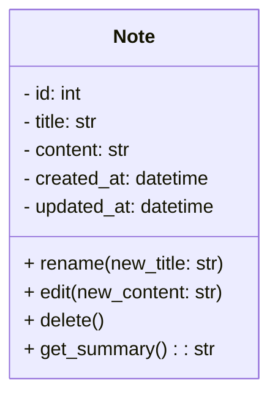

In the UML class diagram notation shown above:
- The class name (e.g., Note) is at the top of the box.
- A minus sign (-) before an attribute or method means it is private (only accessible within the class).
- A plus sign (+) before a method means it is public (accessible from outside the class).
- The colon (:) separates the name and the type (e.g., title: str means the attribute title is of type string).
- Parentheses () after a method name indicate it is a function, and any parameters are listed inside.

