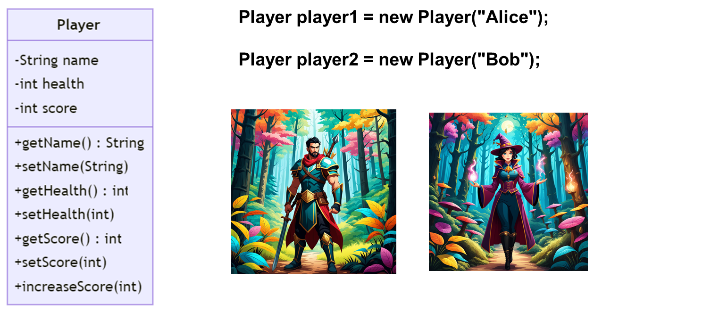
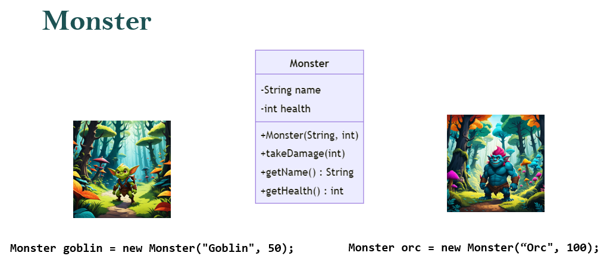
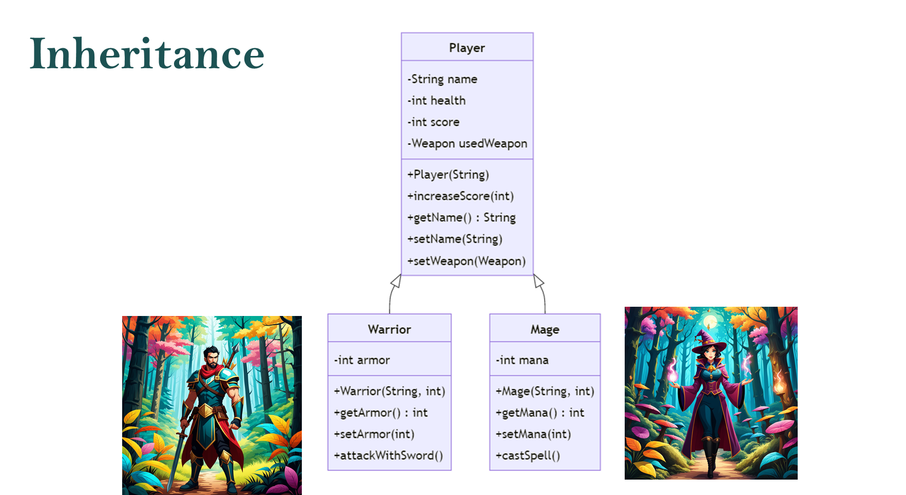
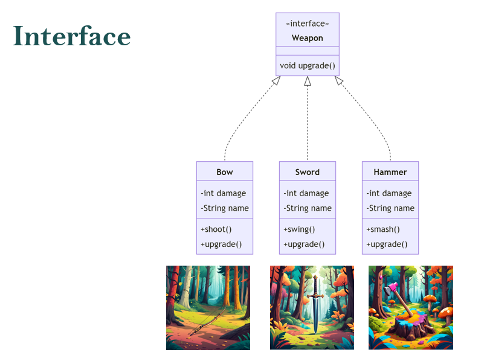
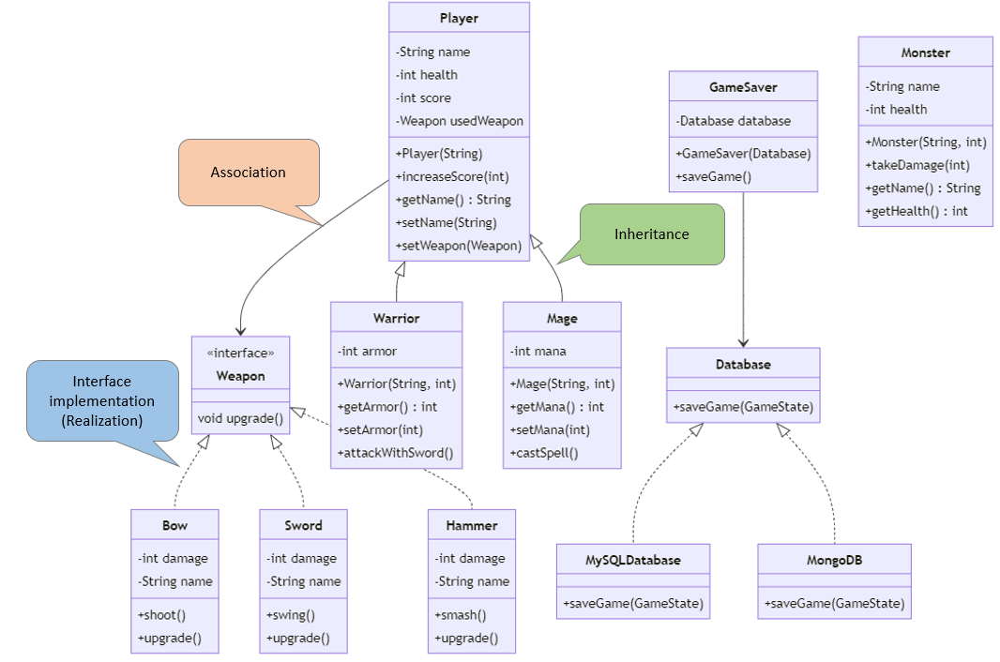
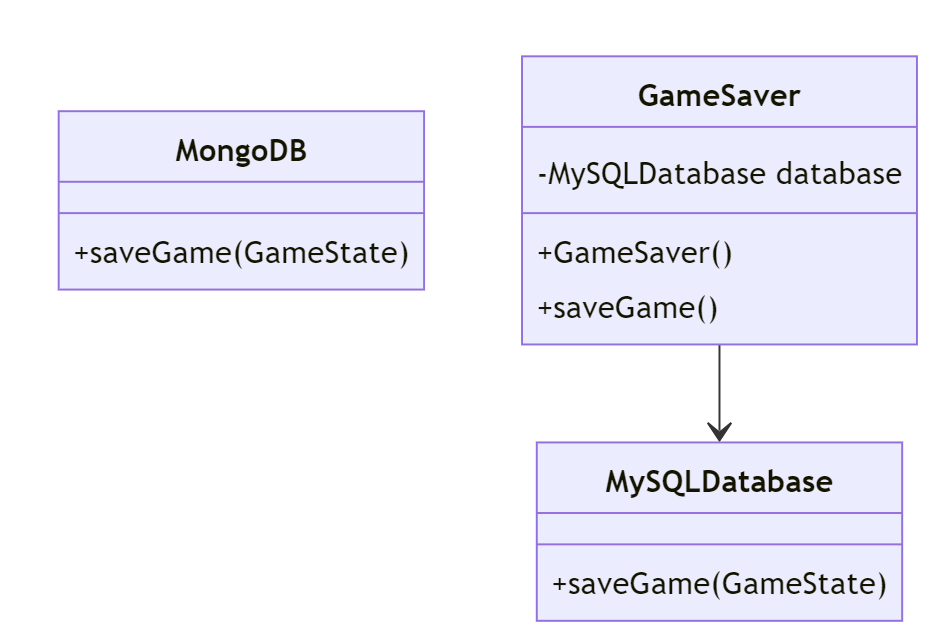
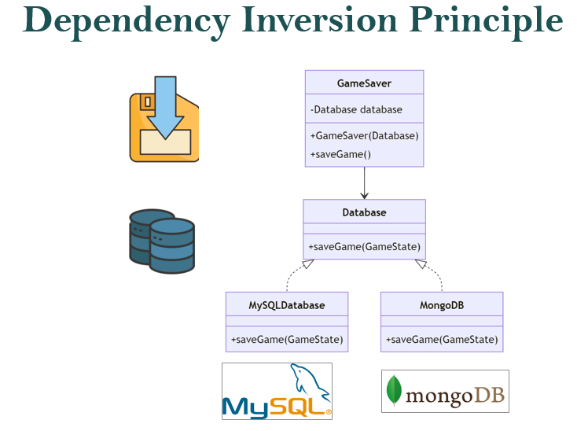

#  Introduction to Object-Oriented Design

## Define the Player Class
In this lecture, we will learn about different Object-Oriented (OO) concepts using an RPG game as an example.

In OO Design, 
- A **Class** is a blueprint for an object.
- An **Object** is an entity that contains both data and behavior


Let's consider the `Player` class as an example. 

**Attributes**: Attributes represent the properties/state of an object. In the case of the `Player` class, there are several attributes such as `name`, `health`, and `score` that define the state of a Player object.
- `name`: A String representing the player's name.
- `health`: An integer value representing the player's health.
- `score`: An integer value representing the player's score.

```java
public class Player {
    private String name;
    private int health;
    private int score;
}
```

**Methods**: Methods define the behavior of an object, detailing what the object can do. In the `Player` class, methods like `increaseScore` alter the object's state or interact with other objects.

```java
public class Player {
    private String name;
    private int health;
    private int score;

    // Constructor 
    public Player(String name) {
        this.name = name;
        this.health = 100; // Default health for a new player
        this.score = 0; // Default score for a new player
    }

    public void increaseScore(int points) {
        score += points;
    }

    // Getter and Setter for name
    public String getName() {
        return name;
    }

    public void setName(String name) {
        this.name = name;
    }

    // Getter and Setter for health
    public int getHealth() {
        return health;
    }

    public void setHealth(int health) {
        this.health = health;
    }

    // Getter for score
    public int getScore() {
        return score;
    }
}
```

A `constructor` is a special method that is invoked when an object of a class is instantiated. It is typically used to initialize the attributes of the class. The `Player` constructor, for example, initializes the player's name, health, and score.


An `object` is an instance of a class, containing the attributes and methods defined in the class. To create a `Player` object, we simply instantiate the class with the new keyword:

```java
Player player1 = new Player("Alice");
Player player2 = new Player("Bob");
```

Methods allow for the manipulation and interaction with an object's data. The `Player` class includes methods like `increaseScore` and getters/setters for managing the attributes.

In Java, object methods are invoked using dot notation. For example, to increase a player's score and then get the updated score, we might do:

```java
public class Game {
    public static void main(String[] args) {
        Player player = new Player("Charlie");
        player.increaseScore(10);
        System.out.println("Player Score: " + player.getScore());
    }
}
```


## UML Diagram



The UML diagram visually represents the structure of the `Player` class, including its attributes, constructor, methods, and their signatures. The class is represented as a rectangle divided into three sections. 
- The top section contains the name of the class (`Player` in this case). 
- The middle section contains the attributes (`name`, `health`, and `score`) with their corresponding types. 
- The `-` symbol before the attribute names (`name`, `health`, and `score`) indicates that they are private, meaning they can only be accessed within the class itself.
- The `+` symbol before the method names (`Player(String)`, `increaseScore(int)`, `getName()`, etc) indicates that they are public, meaning they can be accessed from other classes.
- The `()` after the method names indicates that they are methods (functions) of the class.
- The `String`, `int`, and other data types represent the types of attributes and return types of methods.
- The `: String` after `getName()` indicates that the return type of the method is `String`.
- The parameters of the methods (`String name` in `Player(String)`, `int points` in `increaseScore(int)`, etc) indicate the input values that can be passed to the methods when they are called.

---

# Fundamental OO Concepts

## Encapsulation

Encapsulation is a fundamental principle of object-oriented programming that restricts direct access to an object's attributes. It avoid  the data and code being tied together within an object from being randomly accessed by other code defined outside the object or class.



The `Monster` class represents a monster in the game. It typically includes attributes like name and health, and methods to manage these attributes.

```java
public class Monster {
    private String name;
    private int health;

    // Constructor
    public Monster(String name, int health) {
        this.name = name;
        this.health = health;
    }

    public void takeDamage(int amount) {
        health -= amount;
        if (health < 0) {
            health = 0;
        }
    }

    // Getters
    public String getName() {
        return name;
    }

    public int getHealth() {
        return health;
    }
}
```
In the `Monster` class, the `name` and `health` variables are encapsulated. 
- They are declared as private, which means they cannot be accessed directly from outside the class. 
- Access is provided through the public methods `getName()`, `getHealth()`, and `takeDamage(int amount)`.
- The `takeDamage(int amount)` method is a public method that allows external code to interact with the `health` attribute in a controlled way. It reduces the `health` by the amount specified, but also ensures that `health` cannot go below 0. If another class tries to directly change the health attribute like monster.health = -10;, it would result in a compile error, because health is private. 
- By making `health` private, it cannot be directly accessed or modified from outside the class. This prevents the health from being set to an invalid value (like a negative number) accidentally. 
- The `takeDamage(int amount)` method provides a controlled way to modify the health value, ensuring that it cannot go below 0.

Let's instantiate two monsters. 

```java
Monster goblin = new Monster("Goblin", 50);
Monster orc = new Monster("Orc", 100);
```


##  Inheritance

Inheritance is a mechanism in Java that allows one class to acquire the properties (fields) and behaviors (methods) of another class. 
- The class which inherits the properties of another class is known as the **subclass** (or derived class, child class)
- The class whose properties are inherited is known as the **superclass** (or base class, parent class).



The `Player` class represents a player in the game. 

```java
public class Player {
    private String name;
    private int health;
    private int score;

    // Constructor 
    public Player(String name) {
        this.name = name;
        this.health = 100; // Default health for a new player
        this.score = 0; // Default score for a new player
    }

    public void increaseScore(int points) {
        score += points;
    }

    // Getter and Setter for name
    public String getName() {
        return name;
    }

    public void setName(String name) {
        this.name = name;
    }

    // getters and setter methods for other attributes...

}
```

Create a new class named `Warrior` that extends `Player`. 
- The `Warrior` class inherits all the public and protected members (fields and methods) of Player.


```java
public class Warrior extends Player {
    private int armor;

    public Warrior(String name, int armor) {
        super(name);
        this.armor = armor;
    }
}
```

We may add new methods that are specific to a Warrior. For example, a Warrior might have a method to attack with a sword.

```java
public class Warrior extends Player {
    private int armor;

    public Warrior(String name, int armor) {
        super(name);
        this.armor = armor;
    }

    //getter and setter methods ...

    public void attackWithSword() {
        // Implementation of attackWithSword
    }
}
```


Inheritance promotes reusability and is a way to achieve runtime polymorphism. It can save you significant time and effort by allowing you to reuse code that's already been tested and debugged.

For instance, let's consider the `Warrior` class that extends the `Player` class in our game. 
- The `Player` class might have attributes like `name`, `health`, and `equippedWeapon`, and methods to manage these attributes and perform actions like `attack()` and `equipWeapon()`.
- When we create the `Warrior` class, we don't have to write all this code again. Instead, we can simply extend the `Player` class, and the `Warrior` class will automatically have all the attributes and methods of the `Player` class. This promotes reusability.

---

**Exercise**: 
Create other types of players, such as Mage or Archer.

Mage Class
1.	The Mage class should extend the Player class.
2.	Add a new attribute mana (int) to represent the mage's magic energy.
3.	Add a constructor that takes name and mana as parameters and initializes these attributes along with the attributes from the Player class.
4.	Add getter and setter methods for mana.
5.	Add a method castSpell() that represents the mage casting a spell. The implementation can be simple, such as printing a message.

---
**Sample solution**:

```java
public class Mage extends Player {
    private int mana;

    public Mage(String name, int mana) {
        super(name);
        this.mana = mana;
    }

    public int getMana() {
        return mana;
    }

    public void setMana(int mana) {
        this.mana = mana;
    }

    public void castSpell() {
        if (mana > 0) {
            System.out.println(getName() + " casts a spell!");
            mana--;
        } else {
            System.out.println(getName() + " is out of mana!");
        }
    }
}
```

## Interface and Abstraction

An interface in OO defines a contract that a class agrees to follow. 
- This contract is a set of methods that the class must implement, providing the necessary behavior but not the specific implementation details. 
- To ensure that different classes adhere to a certain protocol of methods, which is especially useful when different objects are used interchangeably.



Let's begin by defining a simple `Weapon` interface with an `upgrade()` behavior. 
-  The purpose of an interface is to specify a contract or behavior that classes can implement. There is no implementation provided in the interfac
-  Interface does not include any attributes. This is because interfaces in Java are used to declare methods that a class must implement, not to define the state of an object.

```java
public interface Weapon {
    void upgrade();
}
```

We will now implement the `Weapon` interface in two different classes: `Bow` and `Sword`. 
- Each class will have its own attributes like `damage` and `name`, and by implementing the `Weapon` interface, they must provide the `upgrade()` method.
- The `swing()` and `shoot()` methods are action methods specific to the Sword and Bow classes respectively. They simulate the actions of swinging a sword and shooting an arrow in the context of a game.

```java
public class Bow implements Weapon {
    private int damage;
    private String name;

    // Constructor and other methods (getters, setters) would be here

    public void upgrade() {
        damage += 10; 
        System.out.println(name + " has been upgraded. New damage is " + damage);
    }

    public void shoot() {
        System.out.println(name + " shoots an arrow causing " + damage + " damage.");
    }    
}
```

```java
public class Sword implements Weapon {
    private int damage;
    private String name;

    // Constructor and other methods (getters, setters) would be here

    public void upgrade() {
        damage += 15; // Swords get a higher damage boost on upgrade
        System.out.println(name + " has been upgraded. New damage is " + damage);
    }

    public void swing() {
        System.out.println(name + " swings causing " + damage + " damage.");
    }
}
```

Here's how you can instantiate Sword and Bow objects:
```java
// Create a new Sword object and use it
Sword sword = new Sword();
sword.setName("Blade of Destiny");
sword.setDamage(50);
sword.swing();
sword.upgrade();

// Create a new Bow object and use it
Bow bow = new Bow();
bow.setName("Longbow");
bow.setDamage(30);
bow.shoot();
bow.upgrade();
```

Suppose that the players' weapon can get an upgrade if their score reaches or exceeds 100. Here is the updated code.

```java
public class Player {
    private Weapon weapon;
    private int score;

    public Player(Weapon weapon) {
        this.weapon = weapon;
        this.score = 0;
    }

    public void increaseScore(int points) {
        score += points;
        if (score >= 100) {
            weapon.upgrade();
        }
    }
}
```

**Abstraction** in object-oriented design is a process of hiding the implementation details and showing only the functionality to the user. It lets you focus on what the object does instead of how it does it.

In the given `Player` class, the `weapon` attribute is of type `Weapon`, which is an interface. The `Weapon` interface defines a contract that includes an `upgrade` method. However, the interface does not provide any implementation details for this method. This is an example of abstraction - the `Weapon` interface provides a high-level understanding of what a weapon should be able to do (i.e., it should be upgradable), without getting into the specifics of how this is done.

The `Player` class uses this abstraction in its `increaseScore` method. When the player's score reaches or exceeds 100, the weapon's `upgrade` method is called. The `Player` class doesn't need to know how the `upgrade` method works for each specific type of weapon. It only needs to know that the `upgrade` method exists and can be called on the weapon.

This is the essence of abstraction - the specific implementation details of how each type of weapon is upgraded are hidden from the `Player` class. The `Player` class interacts with the `Weapon` interface, not the specific classes that implement this interface. This makes the code more flexible and easier to maintain and extend. The `Player` class can interact with any object that implements the `Weapon` interface, without needing to know the specific details of how each type of weapon is upgraded. This is a key aspect of abstraction known as polymorphism.


## Polymorphism

Polymorphism is another fundamental concept in object-oriented programming (OOP). 
- The term "polymorphism" comes from Greek and means "many shapes". In the context of OOP, it refers to the ability of a variable, function, or object to take on multiple forms.
- In Java, polymorphism allows us to perform a single action in different ways. 
- The most common use of polymorphism in OOP occurs when a parent class reference is used to refer to a child class object. This allows us to write code that does not need to know what specific subtype of object it is working with, as long as the object adheres to the expected interface.

With both `Bow` and `Sword` classes implementing the `Weapon` interface, we can now use them interchangeably where a `Weapon` type is expected, and we can be assured that both have an `upgrade()` method.

```java
Weapon bow = new Bow(20, "Longbow");
Weapon sword = new Sword(30, "Sabre");

// Upgrade both weapons
bow.upgrade();
sword.upgrade();
```

Let's modify our `Player` class as follows,
- Add a `Weapon` attribute named `UsedWeapon``. This attribute represents the weapon currently being used by the player. 
- Add a `setWeapon(Weapon weapon)` method. This method allows us to set the UsedWeapon attribute to a specific `Weapon` object. 

```java
public class Player {
    private String name;
    private int health;
    private int score;
    private Weapon UsedWeapon;

    // Constructor 
    public Player(String name) {
        this.name = name;
        this.health = 100; 
        this.score = 0; 
    }

    public void increaseScore(int points) {
        score += points;
    }

    public void setWeapon(Weapon weapon) {
        this.UsedWeapon = weapon;
    }
}
```

This design allows for flexibility and extensibility in our code. 
- We can easily add new types of weapons to our game by creating new classes that implement the Weapon interface
- We can use these new weapons with the Player class without making any changes to the Player class itself.

Let's say we want to introduce a new weapon type to our game, e.g. a Hammer. To do this, we would create a new Hammer class that implements the Weapon interface. Here's a simple example:

```java
public class Hammer implements Weapon {
    private int damage;
    private String name;

    // Constructor and other methods ...

    public void smash() {
        System.out.println(name + " smashes causing " + damage + " damage.");
    }
}
```

Now, we can use this new `Hammer` class with the *Player* class without making any changes to the `Player` class. We can create a `Hammer` object, and use the `setWeapon()`` method of the Player class to set the player's weapon to the new hammer.

```java
// Create a new Hammer object
Hammer hammer = new Hammer();
...
player.setWeapon(hammer);
```

## Interface for defining common behavior

In the context of our RPG game, we might have different types of characters and objects such as Monster, Player, and NPC.
-  Each of these can have some common behaviors, but they also have unique characteristics. 
- Eg., both a `Player` and a `Monster` might have attack and `takeDamage` methods, but a Player/NPC may talk while a Monster does not.

To implement common behavior, you can define interfaces. For example, you might have:
- `Attackable` interface with methods like attack and takeDamage.
- `Talkable` interface with methods like talk. Then, your `Player` class can implement both `Attackable` and `Talkable`, while Monster implements only `Attackable`.

Example:
```java
public interface Talkable {
    void talk(Talkable partner);
}

public class Player implements Attackable, Talkable {
    // Implement  methods from Attackable and Talkable
}

public class Monster implements Attackable {
    // Implement all methods from Attackable
}

public class NPC implements Talkable {
    // Implement all methods from Talkable
}

```
## UML Class Diagram 

In UML (Unified Modeling Language) class diagrams, the relationships and structures of classes in an object-oriented system are graphically represented.

UML Class Diagram Components:
- **Classes**: Represented by rectangles divided into three parts: the top part for the class name, the middle part for attributes, and the bottom part for methods.
- **Relationships**: Different types of lines and arrows are used to depict various relationships like inheritance, association,  interface implementation (realization), and association.



Types of relationship:
1.	**Is-a Relationship** (Inheritance/Generalization):
- This is depicted by a line with a closed, unfilled arrowhead pointing from the subclass to the superclass.
- In our example, `Warrior` and `Mage` are subclasses of `Player`. This is an is-a relationship because a Warrior is-a Player, and a Mage is-a Player.
- Example: A line with an arrowhead from Warrior to Player and from Mage to Player.


2.	**Has-a Relationship** (Association/Aggregation/Composition):
- This represents that an object of one class 'owns' or 'uses' objects of another class.
- In your example, the *Player* class has a Weapon. This is a has-a relationship because a *Player* has-a *Weapon*.
- Example: A line from *Player* to *Weapon* indicate aggregation or composition.


3.	**Interface Implementation**:
- This is depicted by a dashed line with a closed, unfilled arrowhead pointing from the implementing class to the interface.
- In our example, Bow and Sword implement the Weapon interface.
- UML Example: Dashed lines with arrowheads from Bow and Sword to Weapon.


# SOLID Principle

SOLID is an acronym representing five key design principles intended to make software designs more understandable, flexible, and maintainable.

1. **Single Responsibility Principle (SRP):** A class should have only one reason to change.
2. **Open/Closed Principle (OCP):** Software entities (classes, modules, functions, etc.) should be open for extension but closed for modification.
3. **Liskov Substitution Principle (LSP):** Objects of a superclass should be replaceable with objects of its subclasses without affecting the correctness of the program.
4. **Interface Segregation Principle (ISP):** Clients should not be forced to depend on interfaces they do not use. It is better to have multiple specific interfaces rather than a single general-purpose interface.
5. **Dependency Inversion Principle (DIP):** High-level modules should not depend on low-level modules. Both should depend on abstractions. Abstractions should not depend on details, but details should depend on abstractions.

These principles serve as guidelines for designing software systems that are modular, maintainable, and easily extensible.

## Single Responsibility Principle (SRP)

The Single Responsibility Principle dictates that a class should have only one reason to change, meaning it should have only one job or responsibility.

In our RPG game, we ensure each class has a single responsibility. For instance, the `Weapon` class is only responsible for weapon-related attributes and behaviors. It should not include logic for saving game state or managing player health.

## Open/Closed Principle (OCP)
The Open/Closed Principle states that software entities should be open for extension, but closed for modification. This means creating modules that can be extended without altering their existing code.

In our game,when introducing new weapon types like `MagicWand`, instead of modifying the existing `Weapon` class, we may extend it to support new types of weapons. This approach allows for adding new functionalities without changing the existing code.

```java
public class Player {
    // Rest of the code...

    public void setWeapon(Weapon weapon) {
        this.UsedWeapon = weapon;
    }
}
```
```java
public Interface Weapon {
    // Existing weapon code...
}
```

```java
public class MagicWand implement Weapon {
    private int magicPower;

    // Magic wand specific methods...
}
```
```java
MagicWand my_weapon = new MagicWand();
player.setWeapon(my_weapon);
```

## Liskov Substitution Principle (LSP)
According to LSP, objects of a superclass should be replaceable with objects of its subclasses without affecting the application. In the context of the Weapon class and its potential subclasses, to adhere to LSP, any subclass of `Weapon` should be able to be used wherever a Weapon object is expected, without causing any issues or changes in behavior.

For instance, suppose we add an method to attack a monster. We should be able to use any subclass of the `Weapon` interface to attack the `Monster`.

```java
public class Monster {
    private String name;
    private int health;

    public void attack(Weapon weapon) {
        int damage = weapon.getDamage();
        takeDamage(damage);
    }

    //other codes ...
}
```

## Interface Segregation Principle (ISP)

The Interface Segregation Principle, one of the SOLID principles, states that no client should be forced to depend on methods it does not use. In simpler terms, instead of having one large interface, you should have smaller, more specific interfaces.

In our game,

- **Segregate Interfaces**: Instead of having a single large interface for all actions a character can perform, break it down into smaller interfaces. For example, `Attackable` for attack actions, `Talkable` for talking actions, etc.
- **Implement Only What Is Needed**: Each type of character (like Monster, Player, NPC) should only implement the interfaces that are relevant to it. For instance, a Monster might only implement `Attackable` and not `Talkable`.
- **Flexibility and Maintainability**: This approach makes your code more flexible and maintainable. If you need to add a new type of action, you can create a new interface without modifying existing interfaces or classes that don’t need that action.


## Dependency Inversion Principle (DIP)

### Saving the game

We will start with a `GameSaver` class for saving the state of a game. Consider the following implementation of the class.

```java
public class GameSaver {
    private MySQLDatabase database;

    public GameSaver() {
        this.database = new MySQLDatabase();
    }

    public void saveGame(GameState gameState) {
        database.saveGame(gameState);
    }
}
```

To save the game, we may execute:
```java
GameSaver gameSaver = new GameSaver();
gameSaver.saveGame(gameState);
```

### Coupling

**Coupling** is the degree to which one class knows about another class.  
- If a class has a high degree of knowledge about another class, we say that these classes are "tightly coupled". 
- It makes the system harder to maintain and modify.

**Cohesion** is used to indicate the degree to which a class has a single, well-focused purpose. 

Good OO design should be loosely coupled and highly cohesive.
- Easier to develop
- Easier to maintain
- Easier to add new features
- Less fragile.

In the previous `GameSaver` example, the `MySQLDatabase` instance represents a dependency of the `GameSaver` class.
- The `GameSaver` class directly instantiates a MySQLDatabase object in its constructor and uses this object to save the game state. 
- GameSaver class is tightly coupled with the `MySQLDatabase` class.

The problem with this design is that if you want to change the type of database (for example, from MySQL to MongoDB), you would need to modify the `GameSaver` class. For instance, 

```java
public class GameSaver {
    private MongoDB database;

    public GameSaver() {
        this.database = new MongoDB();
    }

    public void saveGame() {
        database.saveGame(GameState gameState);
    }
}
```

You have to modify the `GameSaver` class every time you want to change the type of database used by the class. A better approach would be to decouple `GameSaver` from the specific database classes using the "Dependency Inversion Principle".

A "dependency" here here refers to an object that can be used as a service. In this example, the GameServer depends on the concrete implementation of the databases (e.g. MySQLDatabase or MongoDB).


###  Dependency Inversion Principle (DIP)

The DIP states that high-level modules should not depend on low-level modules. Both should depend on abstractions.



In the context of the `GameSaver` example, GameSaver is a high-level module and Database (`MySQLDatabase` and `MongoDB` classes) are  a low-level module. 
- By having `GameSaver` depend on the Database interface (an abstraction), rather than on concrete Database implementations (MySQLDatabase or MongoDB), we are adhering to the Dependency Inversion Principle. 
- This makes `GameSaver` more flexible and easier to maintain, as it can work with any type of database that implements the Database interface.


#### Dependency Injection

*Dependency Injection* is a technique that implements the *Dependency Inversion Principle*, where an object receives other objects it depends on, rather than creating them itself. These dependencies are usually provided through a constructor, a setter, or some kind of factory method.

First, we define a `Database` interface, which  declares a method `saveGame(GameState gameState)`, which is expected to be implemented by any class that implements this interface. The `saveGame`` method is intended to save a game state to a database.

```java
public interface Database {
    void saveGame(GameState gameState);
}
```
Next, two classes `MySQLDatabase` and `MongoDB` are defined, both of which implement the `Database` interface. This means they provide their own implementations of the `saveGame` method.

```java
public class MySQLDatabase implements Database {
    public void saveGame(GameState gameState) {
        // Implementation for saving game to a MySQL database
    }
}
```
```java
public class MongoDB implements Database {
    public void saveGame(GameState gameState) {
        // Implementation for saving game to a MnogoDB database
    }
}
```

Let's improve the design of  the `GameSever` class. 
- The specific type of `Database` (e.g., `MySQLDatabase` or `MongoDB`) is provided to the `GameSaver` class through its constructor. 
- The `GameSaver` class doesn't need to know the specific type of `Database` it's working with. Instead, it works with any object that implements the `Database` interface.

```java
public class GameSaver {
    private Database database;

    public GameSaver(Database database) {
        this.database = database;
    }

    public void saveGame() {
        database.saveGame();
    }
}
```

By passing different *Database* instances to the `GameSaver` constructor, you can save the game state using different types of databases without modifying the `GameSaver` class.

For instance, for using the MySQL database,
```java
Database mySqlDatabase = new MySQLDatabase();
GameSaver gameSaver = new GameSaver(mySqlDatabase);
gameSaver.saveGame(); // Save the game state using MySQLDatabase
```

If we want to change to MongoDB, there is no need modify existing classes (e.g. `GameSaver`)

```java
Database mongoDB = new MongoDB();
GameSaver gameSaver = new GameSaver(mongoDB);
gameSaver.saveGame(); // Save the game state using MongoDB
```

The improved design allows for flexibility in choosing the type of database to use for saving the game. Any class that implements the `Database` interface can be used, making it easy to switch between different types of databases.

### Types of Dependency Injection 

**Constructor Injection**: 
In this type, the dependencies are provided through a class constructor. This is the most common type of DI and is typically used when the dependency is required for the class to function.

```java
public class GameSaver {
    private Database database;

    //The databse object is injected through this constructor
    public GameSaver(Database database) {
        this.database = database;
    }

    public void saveGame(GameState gameState) {
        database.saveGame(gameState);
    }
}
```
A concrete `Database` object is injected from outside when the `GameSaver` object is instantiated.

```java
Database mySqlDatabase = new MySQLDatabase();
GameSaver gameSaver = new GameSaver(mySqlDatabase);
```

**Setter Injection**

In this type of dependency injection, the client exposes a setter method that the injector uses to inject the dependency. This is typically used when the dependency is optional.

 ```java
 public class GameSaver {
    private Database database;

    public void setDatabase(Database database) {
        this.database = database;
    }

    public void saveGame(GameState gameState) {
        if(database != null) {
            database.saveGame(gameState);
        }
    }
}
```

The `GameServer` class first created. The setter method is then called to inject the concrete `Database` object.

```java
Database mySqlDatabase = new MySQLDatabase();
GameSaver gameSaver = new GameSaver();
gameSaver.setDatabase(mySqlDatabase);
```
### Testing with Mock objects

During Unit Testing, mock objects are used in testing to simulate the behavior of real, complex objects in a controlled way (E.g. when testing functions which interacts with files, database, or external systems). For instances, testing functions which integrate with database  directly can be complex, slow, and unreliable.

Mocking databases allow us to isolate and test our application logic without involving the actual database operations. 
- Faster as they operate in-memory, eliminating the time taken for actual database calls. 
-  Simplify testing by easily simulating any state of the database required for the test. 
- Mock databases also provide reliable and consistent results, unaffected by external factors like network issues or database downtime. 


The Dependency Inversion Principle (DIP) facilitates testing of the `GameSaver` class by making it possible to inject mock database objects during testing. 
- When writing tests for the `GameSaver` class, you can create a mock `Database` object and inject this mock object into the `GameSaver` class. 
- The mock `Database` object would mimic the behavior of a real `Database` object, but without any of the side effects (like actually saving data to a database). 
- This allows you to test the `GameSaver` class in isolation, without needing to set up and tear down a real database for each test.

Here's a simple example of what the `MockDatabase` class might look like:

```java
public class MockDatabase implements Database {
    private boolean saveGameCalled = false;

    @Override
    public void saveGame(GameState gameState) {
        saveGameCalled = true;
    }

    public boolean wasSaveGameCalled() {
        return saveGameCalled;
    }
}
```

The `MockDatabase` is a mock object that simulates the behavior of a real `Database` object for testing purposes. 
- It implements the `Database` interface, but instead of performing actual database operations, it simply records information about how its methods were called, which can then be checked in your tests. 
- The `MockDatabase` might have a method `wasSaveGameCalled()` that returns `true` if its `saveGame` method was called, and `false` otherwise. This allows your tests to verify that the `GameSaver` class correctly calls the `Database`'s `saveGame` method when its own `saveGame` method is called.
- The `MockDatabase`'s `saveGame` method simply sets a private `saveGameCalled` flag to `true` when it's called. The `wasSaveGameCalled` method then returns the value of this flag. This allows your tests to check whether the `saveGame` method was called by checking the value returned by `wasSaveGameCalled`.

Here is a sample JUnit Test case using the `MockDatabase`.

```java
import org.junit.jupiter.api.Test;
import static org.junit.jupiter.api.Assertions.assertTrue;

public class GameSaverTest {
    @Test
    public void testSaveGame() {
        // Create a mock Database object
        MockDatabase mockDatabase = new MockDatabase();

        // Inject the mock Database object into a GameSaver object
        GameSaver gameSaver = new GameSaver(mockDatabase);

        // Create a mock GameState object
        GameState mockGameState = new MockGameState();

        // Call the method under test
        gameSaver.saveGame(mockGameState);

        // Verify that the mock Database's saveGame method was called
        assertTrue(mockDatabase.wasSaveGameCalled());
    }
}
```

### Inversion of Control (IoC) container
In frameworks such as Java spring, the creation and management of dependencies is outsourced to to an Inversion of Control (IoC) container responsible for instantiating, configuring, and assembling the objects in your application.

In Spring boot, you can define your configuration in `application.yaml` (or `application.yml`) files. For example, if you have different configurations for MySQL and MongoDB, you might define two files: `application-mysql.yml` and `application-mongodb.yml`.

Here's an example of what `applcation-mysql.yml` might look like:

```yaml
spring:
  datasource:
    url: jdbc:mysql://localhost:3306/mydatabase
    username: myusername
    password: mypassword
```

And `application-mongodb.yml`:
```yaml
spring:
  data:
    mongodb:
      uri: mongodb://localhost:27017/mydatabase
```

You can choose which profile (and thus which configuration file) to use when launching the application  by setting the `spring.profiles.active` property. 

To launch your app with MySQL, you may execute

```bash
./mvnw spring-boot:run -Dspring-boot.run.profiles=mysql
```

To launch your app with MongoDB, you may execute

```bash
./mvnw spring-boot:run -Dspring-boot.run.profiles=mongodb
```

The Inversion of Control (IoC) container in Spring Boot will instantiate the corresponding object and inject it into the application. This automatic creation, configuration, and injection of dependencies is handled by the Spring Framework's IoC container. By outsourcing the creation and management of dependencies to the IoC container, your application components can remain focused on their core responsibilities, leading to cleaner and more maintainable code.